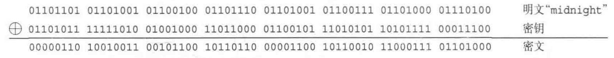

# 密码学入门（2）：对称密码

对称密码是指加密和解密都使用相同的密钥。

## 历史上的密码

下面的两种密码都已经不再使用，但仍然具有学习意义。

### 凯撒密码

**凯撒密码**（Caesar cipher）是通过将明文中所使用的字母表按照一定数量“平移”来进行加密的。

上图为了讲解方便，将加密后的秘文用大小字母表示。

- 加密：将明文中的字母按字母表平移$n$个字母，这里$n$就是密钥。例如明文`yoshiko`经过加密后就变成了`BRVKLNR`（$n$为$3$）。
- 解密：按加密时的密钥进行反向平移。
- 特点：容易被暴力破解，字母表只有$26$个字母，所以密钥只有$0$ - $25$。

### 简单替换密码

凯撒密码通过平移字母表来生成密文，而**简单替换密码**（simple substitution cipher）将字母表中的$26$个字母与这$26$个字母本身建立一一对应关系，每种关系都可以作为密码来使用。

- 加密：将明文中的每个字母按照替换表替换成另一个字母。假设替换表为上图，`yoshiko`经过加密后就变成了`KBLTJSB`。
- 解密：按加密时的替换表反向替换即可。
- 特点：简单替换密码的**密钥空间**（keyspace，可用的密钥总数）为$26$的阶乘，约为$2^{88}$，暴力破解会非常困难，但可以通过**频率分析**来破译。

## 一次性密码本

通过暴力破解法对密钥空间进行遍历，无论什么密文总有一天都能被破译。但**一次性密码本**（one-time pad）是一个例外，即使遍历整个密码空间也绝对无法破译。

- 密钥：与明文等长的随机比特序列。
- 加密：将明文与密钥进行异或运算。

- 解密：将密文与密钥进行异或运算。

- 一次性密码本绝对无法破译的原因：我们可以对密钥进行暴力破解，总有一天我们能得到加密时的密钥，也能解密出明文`midnight`，但我们**无法判断它是否是正确的明文**。这是因为在暴力破解的过程中，所有bit的排列组合都会出现，暴力破解后的明文可能是`aaaaaaaa`、`abcdefgh`、`ZZZZZZZZ`，也可能是`midnight`、`onenight`、`mistress`，即所有可能的排列组合都会出现。
- 一次性密码本为什么没有被使用
  - 最大的问题在于密钥配送：Alice用一次性密码本将数据加密后发送给Bob，但Bob需要知道Alice加密时使用的密钥，因此Alice必须将密钥发给Bob。但这产生了一个矛盾，如果有一种方法能将密钥安全地发送出去，那么岂不是可以用同样的方式来安全地发送明文了吗？

## DES

DES（Data Encryption Standard）是1977年美国联邦信息处理标准（FIPS）中采用的一种对称密码。如今DES的密文可以在短时间内被破译，因此除了用它来解密以前的密文，现在我们不应该再使用DES了。

DES以$64$bit为一个单位进行加密，这个$64$bit的单位称为**分组**。一般来说，以分组为单位进行加密的密码算法称为**分组密码**（block cipher）。

DES的基本结构是由Horst Feistel设计的，因此也称为**Feistel网络**（Feistel network）、**Feistel结构**（Feistel structure）或**Feistel密码**（Feistel cipher）。这一结构不仅用于DES，在其他很多密码算法中也有应用。

在Feistel网络中，加密的各个步骤称为**轮**（round），整个加密过程就是进行若干次轮的循环。

- 加密：将$64$bit的数据分为两部分，每部分$32$bit，分别对应“左侧”和“右侧”。重复多轮，两轮之间左右对调。

- 解密：使用与加密时相反的子密钥。

- 子密钥：每一轮都需要使用一个不同的密钥，因为它只是一个局部密钥，所以称为**子密钥**（subkey）。
- 轮函数：根据“右侧”和子密钥生成对“左侧”进行加密的比特序列。
- 性质
  - 轮数可以任意增加。
  - 加密时使用任何函数作为轮函数都可以正确解密，即使该函数不存在反函数。
  - 加密和解密可以用完全相同的结构来实现。

## 三重DES

由于现在DES已经可以在短时间内被暴力破解，所以三重DES出于这个目的被开发出来了。**三重DES**（triple-DES，3DES）是将DES重复$3$次得到的一种密码算法。

- 加密：使用$3$个DES密钥，进行DES加密->**解密**->加密的过程。

- 解密：与加密过程相反。

- 性质
  - 向下兼容：当密钥$1$、$2$、$3$相同时，三重DES就等同于普通的DES。
  - 处理速度慢，除了特别重视向下兼容的情况以外，很少被用于新用途。

## AES

AES（Advanced Encryption Standard）是取代其前任标准（DES）而成为新标准的一种对称密码算法。全世界的企业和密码学家提交了多个对称密码算法作为AES的候选，最终选出了一种名为Rijndael的对称密码算法，并将其确定为了AES。

AES的选拔过程是由全世界的企业和密码学家共同完成的。由最高水平的密码学家共同尝试破译，依然未能找到弱点，只有这样的事实才能证明一种密码算法的强度。

在募集到的15个算法中，有5个算法入围了**AES最终候选算法**名单（AES finalist）：

- MARS
- RC6
- Rijndael
- Serpent
- Twofish

最后Rijndael力压群雄，被NIST选定为AES标准。

## 应该使用哪种密码

- DES不应再用于任何新的用途，因为现在暴力破解法已经能在现实的时间内完成对DES的破译。
- 我们也没有理由将**三重DES**用于任何新的用途，它会逐渐被AES取代。
- 现在大家应该使用的算法是**AES**（Rijndael）。
- **AES最终候选算法**应该也可以作为AES的备份。和Rijndael一样，这些算法都经过了严格的测试，且没有发现任何弱点。
- 一般来说，我们不应该使用任何**自制的密码算法**，而是应该使用AES。因为AES在选定过程中，经过了全世界密码学家所进行的高品质的验证工作，而自制密码算法很难进行这样的验证。

## 参考

《图解密码技术》
