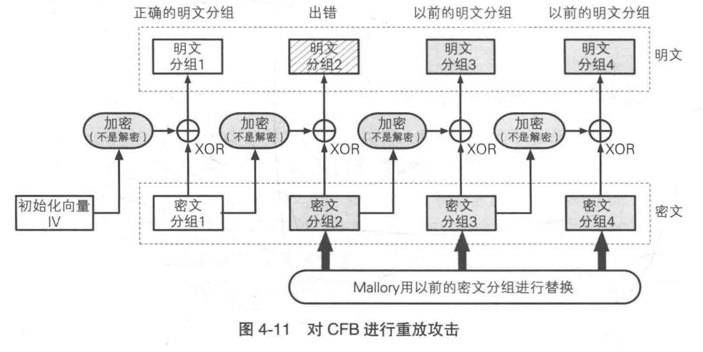

# 密码学入门（3）：分组密码的模式

DES和AES都属于分组密码，它们只能加密固定长度的明文。如果需要加密任意长度的明文，就需要对分组密码进行迭代，而分组密码迭代的方法就称为分组密码的“模式”。

## 分组密码与流密码

- **分组密码**（block cipher）每次只能处理特定长度的一块数据，这里的“一块”就称为**分组**（block），一个分组的比特数就称为**分组长度**（block length）。
- **流密码**（stream cipher）是对数据流进行连续处理的一类密码算法。流密码中一般以$1$比特、$8$比特、$32$比特等为单位进行加密和解密。
- 分组密码处理完一个分组就结束了，因此不需要通过内部状态来记录加密的进度；而流密码是对一串数据流进行连续处理，因此需要保持内部状态。
- 在之前的算法中，只有一次性密码本属于流密码，DES、三重DES、AES（Rijndael）等大多数对称密码算法都属于分组密码。

## ECB模式

**ECB模式**（Electronic CodeBook）非常简单，但由于存在弱点因此通常不会被使用。ECB将明文分组加密后的结果直接变成密文分组：

- 当最后一个明文分组的内容小于分组长度时，需要用一些特定的数据进行**填充**（padding）。
- 特点
  - 由于明文分组与密文分组一一对应，因此根据密文就知道明文中存在怎样的重复组合，可以以此为线索来破译密码。
  - 由于每个明文分组都独立地加密解密，所以密文分组的顺序改变会导致相应的明文分组的顺序改变，因此**攻击者Mallory无需破译密码就能操纵明文**。
    - 例如：

    ~~~text
    密文分组1 = 用户1的名称
    密文分组2 = 用户1的密码
    密文分组3 = 用户2的名称
    密文分组4 = 用户2的密码
    ~~~

    只需要将密文分组$2$和$4$分别用密文分组$1$和$3$覆盖，就能将密码替换成用户名。

## CBC模式

**CBC模式**（Cipher Block Chaining）将前一个密文分组与当前明文分组进行异或运算，然后再进行加密，这样可以避免ECB模式的弱点：

- 由于第一个明文分组不存在“前一个密文分组”，因此通常需要随机产生一个长度为一个分组的比特序列来代替“前一个密文分组”，这个比特序列称为**初始化向量**（Initialization Vector），通常缩写为**IV**。
- 特点
  - 由于明文分组在加密前会与“前一个密文分组“进行异或运算，因此即便明文分组$1$和$2$的值是相等的，密文分组$1$和$2$的值也不一定是相等的。
  - 假设CBC模式的密文分组中有一个密文分组**损坏**（分组的长度不变，值变）了，此时解密时最多只有$2$个分组收到影响（即损坏的分组和损坏分组的下一个分组）。
  - 假设CBC模式的密文分组中有一些比特**缺失**（分组的长度改变）了，那么缺失比特之后的密文分组就无法解密了。
  - 当初始化向量被篡改时，CBC模式的第一个明文分组会受到影响。使用消息认证码可以判断数据是否被篡改。

## CFB模式

**CFB模式**（Cipher FeedBack）中，前一个密文分组会被送回到密码算法的输入端：

- 在ECB模式和CBC模式中，明文分组都是通过密码算法进行加密的，而CFB模式中，明文分组没有通过密码算法直接进行加密。
- 在CFB模式中，密码算法的输出相当于一次性密码本中的随机比特序列。但由于密码算法的输出是通过计算得到的，不是真正的随机数，因此CFB模式不可能像一次性密码本那样具备理论上不可破译的性质。
- CFB模式中由密码算法所生成的比特序列称为**密钥流**（key stream）。由于明文数据可以被逐比特加密，因此我们可以将CFB模式看作是一种**使用分组密码来实现流密码**的方式。
- 对CFB模式可以实施**重放攻击**（replay attack）：

## OFB模式

**OFB模式**（Output-FeedBack）中，密码算法的输入会反馈到密码算法的输出中：

- OFB模式并不是通过密码算法对明文直接进行加密的，而是通过将“明文分组”和“密码算法的输出”进行异或来产生“密文分组”的，在这一点上OFB模式和CFB模式非常相似。
- CFB模式与OFB模式的对比：
  - CFB模式和OFB模式的区别仅仅在于密码算法的输入。
    - CFB模式中，密码算法的输入是前一个密文分组，也就是将密文分组反馈到密码算法中。
    - OFB模式中，密码算法的输入是密码算法的前一个输出，也就是将输出反馈给密码算法。
  - 由于CFB模式是对密文分组进行反馈的，因此必须从第一个明文分组开始按顺序进行加密，也就是说无法跳过明文分组$1$而先对明文分组$2$进行加密。
  - 而在OFB模式中，XOR所需的比特序列（密钥流）可以事先通过密码算法生成，和明文分组无关。

## CTR模式

**CTR模式**（CounTeR）（计数器模式）是一种通过将逐次累加的计数器进行加密来生成密钥流的流密码：

- CTR模式与OFB模式的对比：
  - CTR模式可以以任意顺序对分组进行加密和解密，因为加密和解密时用到的“计数器”可以直接计算出来。这是OFB模式所不具备的。
  - 在OFB模式中，如果对密钥流的一个分组进行加密后其结果碰巧和加密前是相同的，那么这一分组之后的密钥流就会变成同一值的不断反复。而CTR模式就不存在这一问题。
- 能以任意顺序处理分组，就意味着能实现并行计算。因此在支持并行计算的系统中，CTR模式的速度非常快。
- 在CTR模式的基础上增加“认证”功能的模式称为**GCM模式**（Galois/Counter Mode）。我们将在之后讲解。

## 应该使用那种模式

分组密码模式比较表：

## 参考

《图解密码技术》
