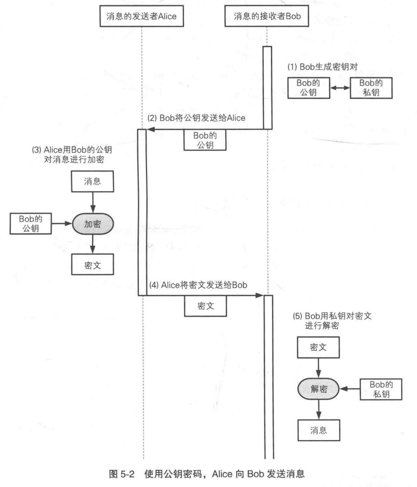
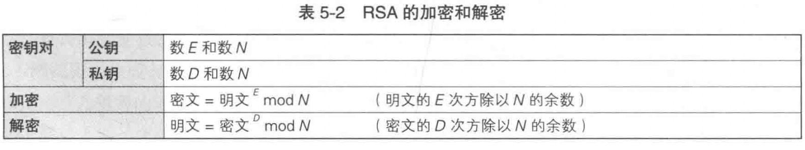
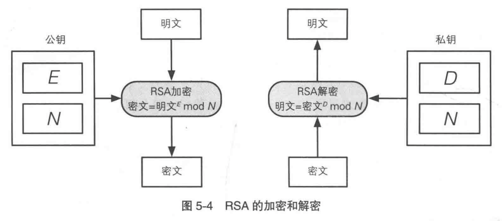
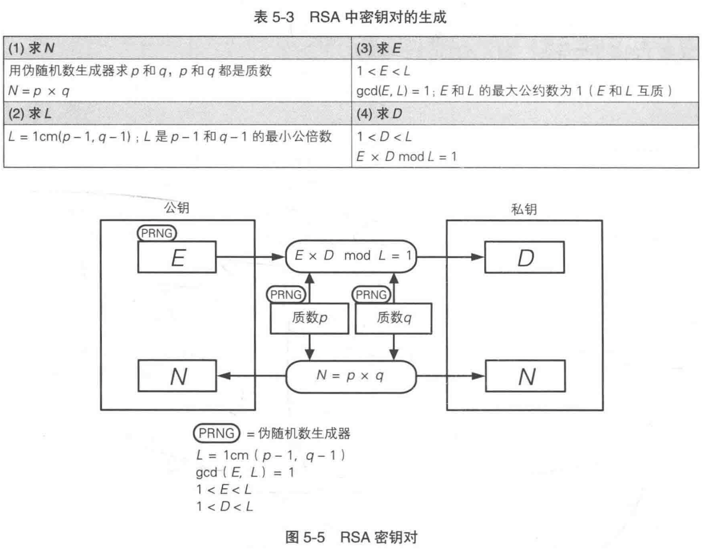
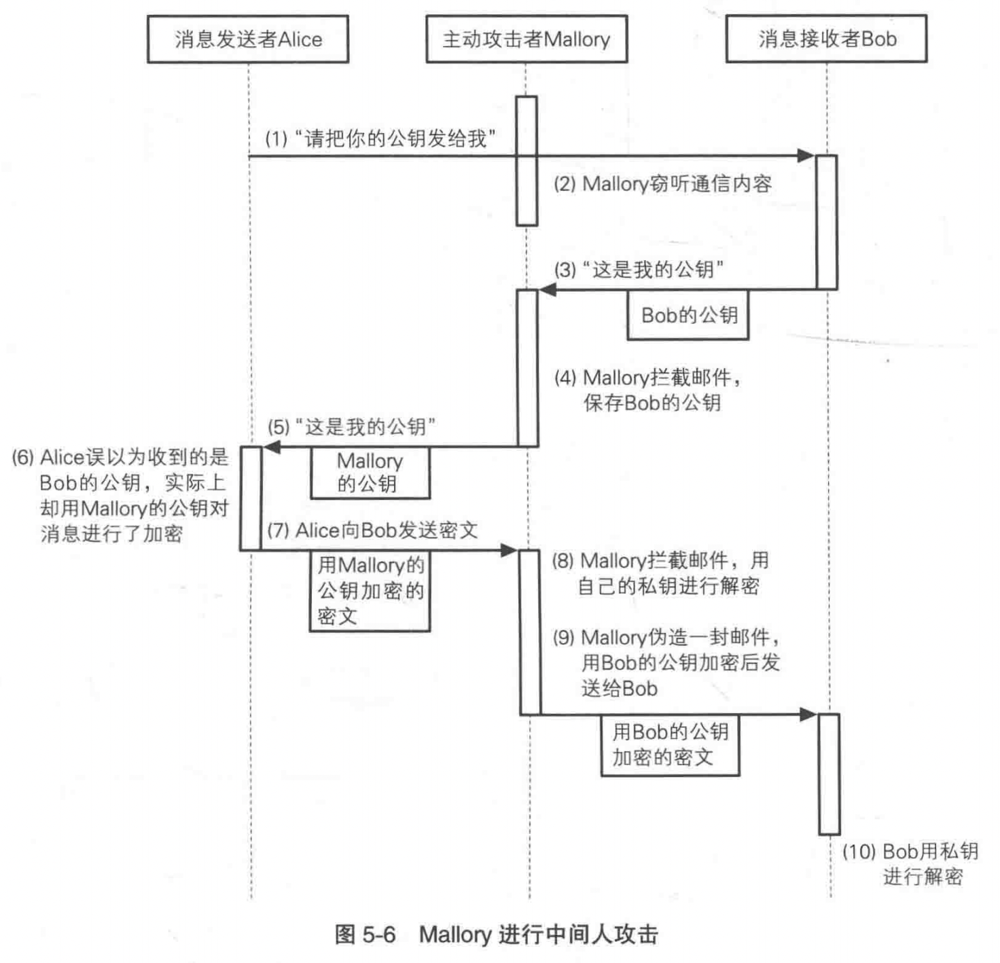
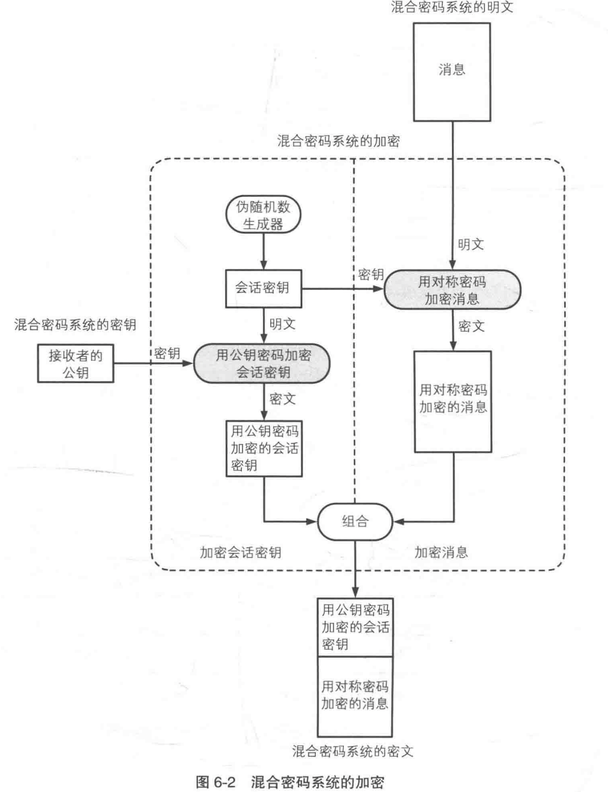
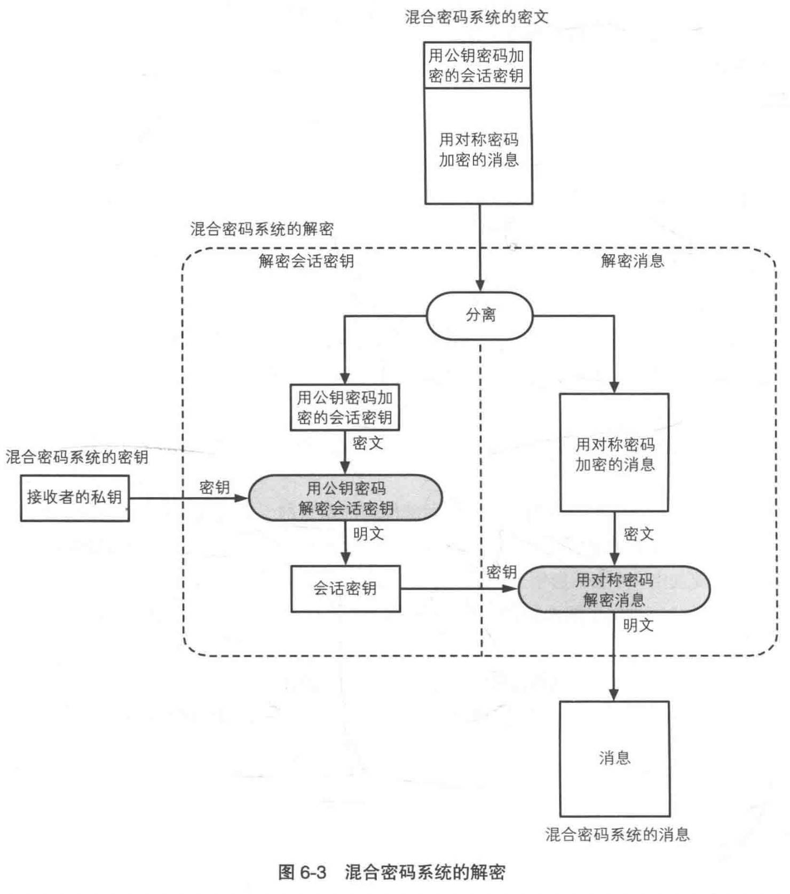

# 密码学入门（4）：公钥密码

公钥密码用公钥加密，私钥解密。

## 密钥配送问题

在对称密码中，由于加密和解密的密钥都是相同的，因此必须向接收者配送密钥。而在Alice将密钥发送给Bob时，会被Eve窃听，因此Eve就能像Bob一样完成密文的解密。

Alice感到一筹莫展。不发送密钥吧，接收者Bob无法解密；发送密钥吧，连窃听者Eve也可以解密了。**密钥必须要发送，但又不能发送**，这就是对称密码的密钥配送问题。

### 解决密钥配送问题的方法

- 通过事先共享密钥来解决：这是最简单的一种解决方法，就是事先用安全的方式将密钥交给对方，这称为密钥的**事先共享**。
  - 问题：假设一个公司有$1000$名员工需要彼此加密通信，因此每个人需要$999$个通信密钥。所以整个公司需要的密钥数量为$1000 \times 999 \div 2 = 499500$。全公司要生成$49$万$9500$个密钥，这是不现实的。
- 通过密钥分配中心来解决：在公司中配置一台充当**密钥分配中心**的计算机，其中保存了公司中每个员工的密钥。当Alice要与Bob通信时：
  1. Alice向密钥分配中心发出希望与Bob进行通信的请求。
  2. 密钥分配中心随机生成一个会话密钥，是本次通信中的临时密钥。
  3. 密钥分配中心将会话密钥分别加密后发送给Alice和Bob（密钥分配中心有Alice和Bob的密钥）。
  4. Alice得到会话密钥后，用它对消息进行加密，然后发送给Bob。
  5. Bob得到会话密钥后，用它对消息进行解密，得到Alice发送的消息原文。
  6. Alice和Bob删除会话密钥。
  - 问题
    - 随着员工数量的增加，密钥分配中心的负荷也回随之增加。
    - 密钥分配中心如果发生故障，全公司的加密通信就会瘫痪。
    - 主动攻击者Mallory可以直接对密钥分配中心下手。
- 通过Diffie-Hellman密钥交换来解决：在Diffie-Hellman密钥交换中，进行加密通信的双方需要交换一些信息，根据所交换的信息，双方可以各自生成相同的密钥。而这些信息即使被窃听者Eve窃听到，也无法生成相同的密钥。
- 通过公钥密码解决：公钥密码中加密密钥和解密密钥是不同的。接收者只需要事先将加密密钥发送给发送方，这个加密密钥即使被窃听者获取也没有问题。发送者使用加密密钥对通信内容进行加密并发送给接受者，而只有拥有解密密钥的人（即接收者本人）才能进行解密。

## 公钥密码

**公钥密码**（public-key cryptography）中，密钥分为加密密钥和解密密钥。发送者用加密密钥对消息进行加密，接收者用解密密钥对密文进行解密。

加密密钥和解密密钥的区别：

- 发送者只需要加密密钥。
- 接收者只需要解密密钥。
- 解密密钥不可以被窃听者获取。
- 加密密钥被窃听者获取也没问题。

由于加密密钥可以任意公开，因此该密钥被称为**公钥**（public key）。而解密密钥时绝对不能公开的，因此称为**私钥**（private key）。公钥和私钥是一一对应的，一对公钥和私钥统称为**密钥对**（key pair）。

公钥通信的流程：

在这个过程中，Alice和Bob之间传输的信息只有Bob的公钥和用Bob的公钥加密的密文。由于Bob的私钥没有出现在通信内容中，因此窃听者Eve无法对密文进行解密。

公钥密码无法解决的问题：

- 会受到中间人攻击。
- 处理速度慢，只有对成密码的几百分之一。

公钥密码除了能保证数据传输的机密性，还能用作数字签名，提供认证功能。例如，假设现在Alice希望把一个数字签署的信息$M'$发送给Bob，那么：

1. Alice可以用私钥加密信息$M'$，得到数字签名$\sigma$。
2. Alice把消息/签名对$(M', \sigma)$发送给Bob。
3. Bob收到$(M', \sigma)$后，他可以利用Alice的公钥解密$\sigma$，如果解密后的数据与$M'$相同，就能证实消息确实来自Alice。

## RSA

RSA是一种公钥密码算法，它的名字是由它的三位开发者，即Ron Rivest、Adi Shamir和Leonard Adleman的姓氏首字母组成的（Rivest-Shamir-Adleman）。

RSA的加密和解密：

在这里，数$E$和数$N$共同组成了公钥$(E, N)$，数$D$和数$N$共同组成了私钥$(D, N)$。其中$E$是加密（Encryption）的首字母，$D$是解密（Decryption）的首字母，$N$是数字（Number）的首字母。同时，被加密的明文需要小于$N$，否则就要将明文分解。

### 生成密钥对

那么，如何生成密钥对？通过上面可以知道，$E$和$N$是公钥，$D$和$N$是私钥，因此求$E$、$D$和$N$这三个数就是**生成密钥对**（这里涉及到了一些数学问题，不感兴趣可以跳过）：

1. 求$N$：选择两个很大的（例如$1024$bit）质数$p$和$q$，那么:
    $$N = p \times q$$

2. 求$L$：$L$这个数在RSA加密和解密中都不出现，它只出现在生成密钥对的过程中。$L$是$p - 1$和$q - 1$的最小公倍数（least common multiple，lcm）：
    $$L = lcm(p - 1, q - 1)$$

3. 求$E$：$E$是一个比$1$大、比$L$小的数，并且$E$与$L$互质，即$E$和$L$的最大公约数为$1$:
   $$
   \begin{cases}
    1 < E < L \\
    gcd(E, L) = 1
   \end{cases}
   $$

4. 求$D$：数$D$是由数$E$计算得到的。$D$、$E$和$L$之间必须具备下列关系：
    $$
    \begin{cases}
    1 < D < L\\
    E \times D\, mod\, L = 1
    \end{cases}
    $$
    要保证存在满足条件的$D$，就需要保证$E$和$L$的最大公约数为$1$，这也是$(3)$中对$E$所要求的条件。

这里面可能会有一些疑问，例如：

- 如何选两个很大的质数？
  - 我们可以生成一个$1024$bit的随机数$n$，然后判断它是否是质数，如果不是则在$n$附近随机选取大约$\ln n$个整数，并进行质数检验。为什么是$\ln n$个整数涉及到了**质数的密度**，具体可以参考《算法导论》。
- 如何选一个和$L$互质的数？
  - 我们可以在$1 < E < L$内随机选一个数，然后再判断它是否满足$gcd(E, L) = 1$，其中求$gcd$可以使用**辗转相除法**，具体可以参考《算法导论》。
- 如何计算$225^{29} mod 323$？
  - 这是一个幂取模问题，可以使用**反复平方法**，具体可以参考《算法导论》。

### 对RSA的攻击

RSA的安全性主要来源于对大整数进行因式分解的困难性。如果破译者能对公钥中的$E \times D\, mod\, L = 1$进行分解，就可以根据公钥推导出密钥。要由$E$计算出$D$，就需要数字$L$，因此就需要知道$p$和$q$。

如果分解大整数是困难的，那么打破RSA也是困难的。经过20多年的研究，人们还没有发现比分解$E \times D\, mod\, L = 1$更容易的方法来打破RSA加密系统。事实上，对大整数的分解是相当困难的。通过随机地选取两个$1024$bit的质数并求出它们的积，就可以创建出一把无法用现行技术在可行的时间内“破解”的公钥。

## 中间人攻击

**中间人攻击**（man-in-the-middle attack）不仅是针对RSA，而是可以针对任何公钥密码。它虽然不能破译公钥密码，但却是一种针对机密性的有效攻击。

所谓中间人攻击，就是主动攻击者Mallory混入发送者和接收者的中间，对发送者伪装成接收者，对接收者伪装成发送者的攻击方式，在这里“Mallory”就是“中间人”。

在这个过程中，公钥密码并没有被破译，所有的密码算法也都正常工作并确保了机密性。然而，所谓的机密性并非在Alice和Bob之间，而是在Alice和Mallory之间，以及Mallory和Bob之间。仅靠公钥密码本身，是无法防御中间人攻击的。

## 其他公钥密码

- ELGamal方式：RSA利用了质因数分解的困难度，而ELGamal方式则利用了$mod\, N$下求离散对数的困难度。但它的缺点是经过加密的密文长度会变成明文的两倍。
- Rabin方式：它利用了$mod\, N$下求平方根的困难度。破译Rabin方式公钥密码的困难度与质因数分解的困难的相当。
- 椭圆曲线密码（Elliptic Curve Cryptography，ECC）：它是通过将椭圆曲线上的特定点进行特殊的乘法运算来实现的，利用了这种乘法运算的逆运算非常困难的特性。它的特点是所需的密钥长度比RSA短。

## 混合密码系统

公钥密码可以避免密钥配送问题，但它的处理速度远远低于对称密码。而混合密码系统可以解决对称密码的密钥配送问题，还能解决公钥密码速度慢的问题。

**混合密码系统**（hybrid cryptosystem）是将对称密码和公钥密码的优势相结合的方法。它用快速的对称密码来对消息进行加密，用公钥密码对加密消息时使用的对称密码的密钥进行加密。由于对称密码的密钥一般比消息本身要短，因此公钥密码速度慢的问题就可以忽略了。

混合密码系统的组成机制：

- 用对称密码加密消息。
- 通过伪随机数生成器生成对称密码加密中使用的会话密钥。
- 用公钥密码加密会话密钥。
- 从混合密码系统外部赋予公钥密码加密时使用的密钥。

混合密码系统的加密：

- 加密消息：消息的加密方式和对称密码的一般加密方法相同。
- 加密会话密钥：**会话密钥**（session key）是指为本次通信而生成的临时密钥，一般通过伪随机数生成器产生。
- **会话密钥是对称密码的密钥，同时也是公钥密码的明文**。

混合密码系统的解密：

### 密码技术的组合

混合密码系统是将对称密码和公钥密码相结合，从而构建出一种同时发挥两者优势的系统。密码学中还有一些多种技术组合而成的技术，我们先做个简单的介绍：

- 数字签名：由单向散列函数和公钥密码组合而成。
- 证书：由公钥和数字签名组合而成。
- 消息认证码：由单向散列函数和密钥组合而成，也可以通过对称密码来生成。
- 伪随机数生成器：可以使用对称密码、单向散列函数或公钥密码来构建。

## 参考

- 《图解密码技术》
- 《算法导论》
