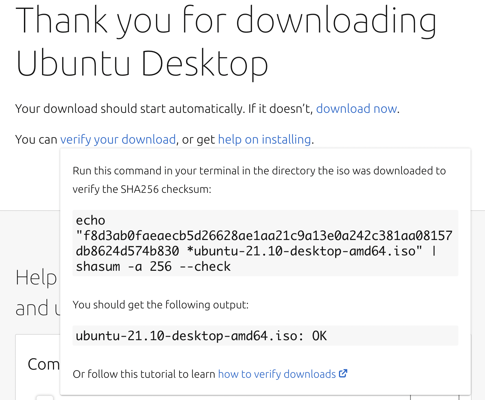
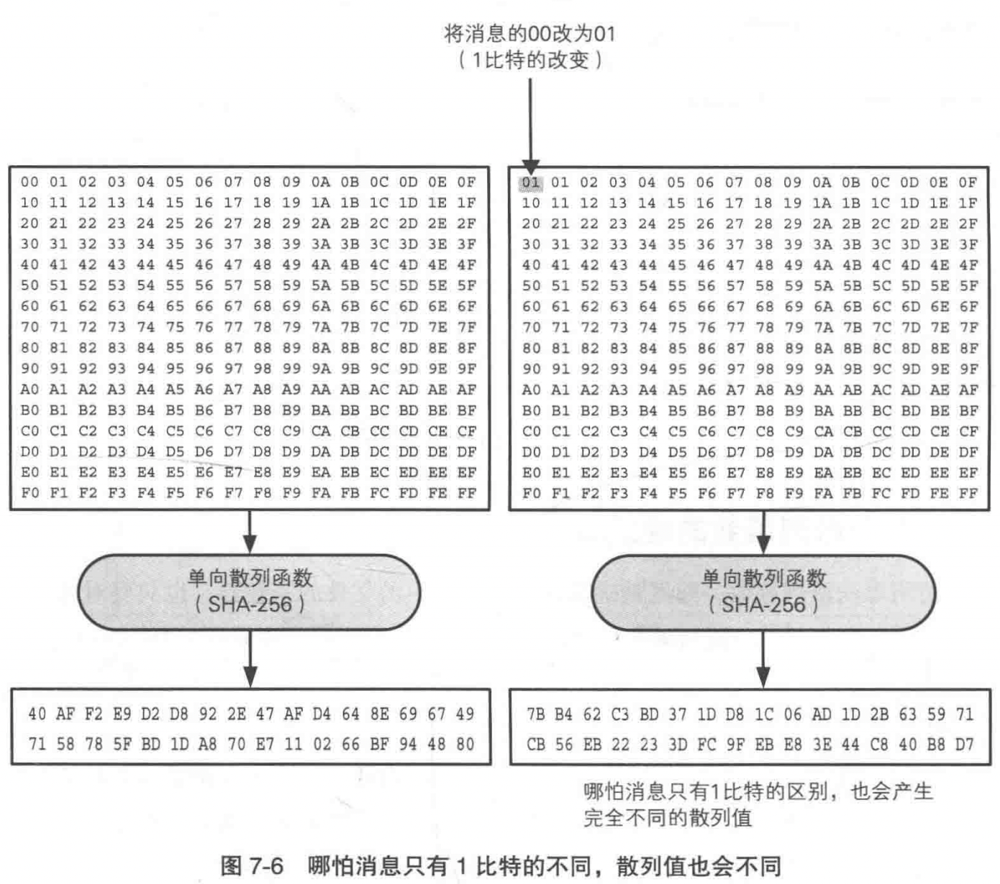

# 密码学入门（5）：单向散列函数

在开始之前，我们先假设一个场景：我们现在想下载一个ubuntu的镜像文件，如何确保我们下载的文件是和原始文件一模一样的呢？下载的过程中可能会因为网络原因，或者其他可能的原因，导致下载的镜像文件不完整，即使是$1$个bit的不同。

其实，我们可能已经接触过单向散列函数了。在下载镜像文件时，在下载页面可能会看到md5、sha256之类的字眼，后面跟了一堆数字和字母的序列。例如：

这里的`f8d3ab0faeaecb5d26628ae1aa21c9a13e0a242c381aa08157db8624d574b830`就是单向散列函数生成的散列值。通过计算下载的镜像文件的散列值，再和这串散列值对比，就可以验证文件是否完整了。这是单向散列函数的一个应用。

## 什么是单向散列函数

**单向散列函数**（one-way hash function）有一个输入和一个输出，其中输入称为**消息**（message），输出称为**散列值**（hash value）。它可以根据消息的内容计算出散列值，而散列值可以用来检查消息的完整性。

单向散列函数的相关术语有很多变体，例如：

- **单向散列函数**也称为**消息摘要函数**（message digest function）、哈希函数或杂凑函数。
- 输入单向散列函数的**消息**也称为**原像**（pre-image）。
- 单向散列函数输出的**散列值**也称为**消息摘要**（message digest）或者**指纹**（fingerprint）。
- **完整性**也称为**一致性**。

单向散列函数除了上面说的可以用来验证文件的完整性，还可以用于构造消息认证码、数字签名、构造伪随机数生成器等。

单向散列函数无法解决的问题：单向散列函数能够辨别出“篡改”，但无法辨别出“伪装”。即只能保证消息的**完整性**，不能对消息进行**认证**。用于认证的技术包括**消息认证码**和**数字签名**，我们将在之后讨论。

## 单向散列函数的性质

- 根据任意长度的消息计算出固定长度的散列值：无论输入多长的消息（$1$字节、$1$MB、$1$GB、$1$TB或更大），输出的散列值都是固定长度（例如sha256是$256$bit）。
- 能够快速计算出散列值。
- 具备单向性：根据消息计算散列值很容易，但根据散列值计算消息很困难。
- 消息不同散列值也不同：消息中哪怕只有$1$比特的改变，也必须有很高的概率产生不同的散列值。
- 抗碰撞性：两个不同的消息产生同一个散列值的情况称为**碰撞**（collision）。难以发现碰撞的性质称为**抗碰撞性**（collision resistance）。
- 雪崩效应：当输入发生最微小的改变（例如，反转一个二进制位）时，也会导致输出的不可区分性改变（输出中每个二进制位有50%的概率发生反转）：

## MD4、MD5

- MD4是由Rivest于1990年设计的单向散列函数，能够产生$128$比特的散列值。现在已经不安全了。
- MD5是由Rivest于1991年设计的单向散列函数，能够产生$128$比特的散列值。现在也不安全了。
- MD4和MD5中的MD是消息摘要（Message Digest）的缩写。

## SHA家族

- SHA-1于1995年发布，是由NIST（National Institute of Standards and Technology）设计的一种能产生$160$比特的散列值的单向散列函数，是MD5的后继者。现在已经被攻破了。
- SHA-2于2001年发布，包括SHA-256、SHA-384、SHA-512等，散列值长度分别为$256$比特、$384$比特和$512$比特。这些单向散列函数合起来统称SHA-2。SHA-2目前没有出现明显的弱点。
- SHA-3与2015年发布，由于对MD5成功的破解，以及对SHA-0和SHA-1出现理论上破解的方法，NIST感觉需要一个与之前算法不同的，可替换的加密散列算法，也就是现在的SHA-3。SHA-3和AES一样采用公开竞争的方式进行标准化，最后一个名叫Keccak的算法胜出，最终成为了SHA-3。

## 暴力破解

假设有一条消息，经过SHA-512计算后的到散列值，由于散列值长度为$512$比特，根据**鸽巢原理**，我们最多只需要尝试$2^{512}$次就能找到一条和原消息不同但散列值相同的消息，但如此多的尝试次数在现实中是不可能完成的。

由于尝试次数纯粹是由散列值的长度决定的，因此散列值长度越长，抵御暴力破解的能力也就越强。

## 生日攻击

**生日攻击**（birthday attack）与暴力破解的不同之处在于，生日攻击不是寻找生成特定散列值的消息，而是要找到散列值相同的两条消息，其中散列值可以是任意值。

假设一个班上有$30$名学生，问至少一名学生和另外任意一名学生有着相同生日的概率是多少？

从直觉上看概率貌似很小，但实际上概率大约为$70.63\%$。

为了计算这个概率，我们可以先计算每个人生日不一样的概率$P'$，然后用$1 - P'$就能得到“至少一名学生和另外任意一名学生有着相同生日的概率”：

$$
\begin{aligned}
P' &= \frac {365} {365} \times \frac {364} {365} \times \frac {363} {365} \times ...\, \times \frac {365 - 30 + 1} {365} \\
&= \frac {365 \times 364 \times 363 \times ...\, \times (365 - 30 + 1)} {356^{30}} \\
&\approx 29.37\% \\
P &= 1 - P'\approx 70.63\%
\end{aligned}
$$

实际上，假设一年有$Y$天，那么$N$人的集合中，至少有两个人生日一样的概率大于$50\%$，$N$至少为$\sqrt Y$，即$Y^\frac 1 2$。

对于$512$比特的散列值来说，$Y$为$2^{512}$，因此对同一单向散列函数进行生日攻击需要的次数为$\sqrt {2^{512}} = 2^{256}$次，比暴力破解所需的攻击次数少得多。

## 应该使用那种单向散列函数

- MD5是不安全的，不应该使用。
- SHA-1除了用于对过去生成的散列值进行校验之外，不应被用于新的用途。
- SHA-2有效应对了针对SHA-1的攻击方法，因此是安全的，可以使用。
- SHA-3是安全的，可以使用。
- 和对成密码算法一样，我们不应该使用任何**自制算法**。

## 参考

- 《图解密码技术》
- <https://zh.wikipedia.org/wiki/%E9%9B%AA%E5%B4%A9%E6%95%88%E5%BA%94>
- <https://zh.wikipedia.org/wiki/SHA%E5%AE%B6%E6%97%8F>
- <https://zh.wikipedia.org/wiki/%E7%94%9F%E6%97%A5%E6%94%BB%E5%87%BB>
