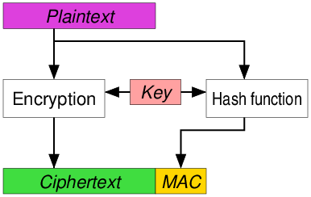
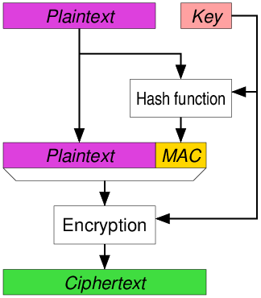

# 密码学入门（6）：消息认证码

上次讲到的单向散列函数只能保证数据传输的完整性，不能提供认证功能，即 Bob 不能确定消息是否来自 Alice，只能确定消息是完整的，没有被篡改。

假设有以下场景，现在 Alice 和 Bob 分别是两家银行：

- Alice 银行向 Bob 银行发送一条汇款请求：从账户 A 向账户 B 汇款**1000**万元。
- Bob 银行能保证收到的汇款请求与 Alice 银行所发送的内容完全一致，如果主动攻击者 Mallory 在中途将汇款请求进行了**篡改**，Bob 银行能识别出这种篡改。
- 但现在问题是，汇款请求到底是不是 Alice 银行发送的？有可能 Alice 银行根本就没有发送过汇款请求，而是由主动攻击者 Mallory **伪装**成 Alice 银行发送的。

所以我们除了要关注汇款请求（消息）的“完整性”，还要关注“认证”问题，即“消息是否来自正确的发送者”。下面要介绍的消息认证码即能保证消息的完整性，还能对消息进行认证。

## 什么是消息认证码？

**消息认证码**（Message Authentication Code）是一种确认完整性并进行认证的技术，简称为**MAC**。

消息认证码的输入为任意长度的**消息**和一个发送者与接收者之间**共享的密钥**，它可以输出固定长度的数据，这个数据称为 **MAC 值**。

根据任意长度的消息输出固定长度的数据，这一点和单向散列函数很类似。但由于计算 MAC 值必须持有共享密钥，没有共享密钥的人就无法计算 MAC 值，因此消息认证码利用这一性质来完成认证。此外，消息认证码和单向散列函数一样具有雪崩效应，哪怕消息中发生$1$比特的变化，也会导致 MAC 值发生不可区分的改变。

消息认证码有多种实现方式，我们可以先简单的将其理解为：消息认证码是一种与密钥相关联的单向散列函数：

我们仍然假设 Alice 和 Bob 是两家银行，消息认证码的使用步骤如下：

消息认证码的密钥配送问题：由于发送者和接收者之间需要共享密钥，这一点和对称密码很相似。实际上，对称密码的**密钥配送问题**在消息认证码中同样会发生。要解决该问题，我们需要像对称密码一样使用一些共享密钥的方法，至于使用哪种配送方法，需要根据具体的目的来进行选择。

## 消息认证码的实现方式

使用 AES之 类的**分组密码**可以实现消息认证码。

我们将分组密码的密钥作为消息认证码的共享密钥来使用，并用 [CBC 模式](https://blog.csdn.net/weixin_43669941/article/details/122798300)将消息全部加密，然后将最后一个密文分组用作 MAC 值。这是因为 CBC 模式的最后一个分组会受到整个消息以及密钥的双重影响，因此可以将它用作消息认证码。

下面我们来看一下使用**单向散列函数**实现的消息认证码：HMAC。

### HMAC

**HMAC**是一种使用单向散列函数来构造消息认证码的方法，其中 HMAC 的 H 就是 Hash 的意思。

HMAC 中使用的单向散列函数并不局限于一种，任何高强度的单向散列函数都可以被用于 HMAC。例如用 SHA-256、SHA-512 所构造的 HMAC，分别称为 HMAC-SHA-256、HMAC-SHA-512。

HMAC 的步骤：

1. 密钥填充
   - 如果密钥比单向散列函数的分组长度要短，就在密钥的末尾填充$0$。
   - 如果密钥比分组长度长，则用单向散列函数求出密钥的散列值，然后将这个散列值用作HMAC的密钥。
2. 填充后的密钥与 ipad 的 XOR
   - 将填充后的密钥与被称为 ipad 的比特序列进行 XOR 运算。**ipad** 是将`00110110`（`0x36`）不断循环反复直到分组长度所形成的比特序列，其中 ipad 的 i 是 inner（内部）的意思。
   - XOR 运算所得到的值，就是一个和单向散列函数分组长度相同，且**和密钥相关的比特序列**，这个比特序列称为 ipadkey。
3. 与消息组合：将 ipadkey 附加在消息的开头。
4. 计算散列值：将$(3)$的结果输入单向散列函数，并计算出散列值。
5. 填充后的密钥与 opad 的 XOR
   - 将填充后的密钥与被称为 opad 的比特序列进行 XOR 运算。**opad** 是将`01011100`（`0x5C`）不断循环反复直到分组长度所形成的比特序列，其中 opad 的 o 是 outer（外部）的意思。
   - XOR 运算所得到的值也是一个和单向散列函数分组长度相同，且**和密钥相关的比特序列**，这个比特序列称为 opadkey。
6. 与散列值组合：将$(4)$的散列值拼在 opadkey 后面。
7. 计算散列值：将$(6)$的结果输入单向散列函数，并计算出散列值。这个散列值就是最终的MAC值。

通过上述流程我们可以看出，最后得到的 MAC 值，一定是一个和输入的消息以及密钥都相关的长度固定的比特序列。

此外，根据 RFC 2104，HMAC 的数学公式为：

$$
{\displaystyle {\textit {HMAC}}(K,m)=H{\Bigl (}(K'\oplus opad)\;||\;H{\bigl (}(K'\oplus ipad)\;||\;m{\bigr )}{\Bigr )}}
$$

其中：

- $H$为密码散列函数（如SHA家族）
- $K$为密钥（secret key）
- $m$是要认证的消息
- $K'$是从原始密钥K导出的另一个秘密密钥（如果$K$短于散列函数的输入块大小，则向右填充（Padding）零；如果比该块大小更长，则对K进行散列）
- || 代表串接
- ⊕ 代表异或（XOR）
- opad 是外部填充（`0x5c5c5c…5c5c`，一段十六进制常量）
- ipad 是内部填充（`0x363636…3636`，一段十六进制常量）

HMAC的伪代码如下：

~~~javascript
function hmac (key, message) {
    if (length(key) > blocksize) {
        key = hash(key) // keys longer than blocksize are shortened
    }
    if (length(key) < blocksize) {
        // keys shorter than blocksize are zero-padded (where ∥ is concatenation)
        key = key ∥ [0x00 * (blocksize - length(key))] // Where * is repetition.
    }
   
    o_key_pad = [0x5c * blocksize] ⊕ key // Where blocksize is that of the underlying hash function
    i_key_pad = [0x36 * blocksize] ⊕ key // Where ⊕ is exclusive or (XOR)
   
    return hash(o_key_pad ∥ hash(i_key_pad ∥ message)) // Where ∥ is concatenation
}
~~~

## 认证加密

**认证加密**（AE或AEAD，Authenticated Encryption，Authenticated Encryption with Associated Data）是一种将对称密码与消息认证码相结合，同时满足机密性、完整性和认证三大功能的机制。常见的AEAD算法有`chacha20-poly1305`和`aes-256-gcm`。

认证加密的方法：

- Encrypt-then-MAC (EtM) ：先用对称密码将明文加密，然后计算密文的MAC值。

- Encrypt-and-MAC（E&M）：用对称密码将明文加密，并对明文计算MAC值。

- MAC-then-Encrypt (MtE) ：先计算明文的MAC值，然后将明文和MAC值同时用对称密码加密。

关于GCM：GCM（Galois/Counter Mode）是一种认证加密方式。GCM使用AES等128比特分组密码的CTR模式，并使用一个反复进行加法和乘法运算的散列函数来计算MAC值。由于CTR模式的本质是对递增计数器值进行加密，因此可通过对若干分组进行并行处理来提高运行速度。此外，由于CTR模式加密与MAC的值计算使用的是相同的密钥，因此在密钥管理方面也更容易。

## 重放攻击

我们仍然假设 Alice 和 Bob 是两家银行，现在有如下场景：

- Mallory 窃听到 Alice 银行与 Bob 银行之间的通信。
- Mallory 到 Alice 银行向自己在 Bob 银行中的账户 M 汇款 $100$ 万元。于是 Alice 银行生成了汇款请求信息，在计算出正确的 MAC 值后将 MAC 和消息一起发送给 Bob 银行。
- Bob 银行收到消息，确认消息是来自 Alice 银行的合法汇款请求，于是向账户 M 汇款 $100$ 万元。
- Mallory 将窃听到的汇款请求信息以及 MAC 值再次发送给 Bob 银行，此时 Bob 银行仍然会确认消息是来自 Alice 银行的合法汇款请求（误解），于是向账户 M 汇款 $100$ 万元。
- Mallory 将上一步过程重复 $100$ 次。
- 最后 Bob 银行向 M 账户累计汇入 $1$ 亿元，这时 Mallory 将这笔钱取出来。

在这里，Mallory 并没有破解消息认证码，而只是将 Alice 银行的正确 MAC 值保存下来重复利用而已。这种攻击方式称为**重放攻击**（replay attack）：

### 防御重放攻击的方式

- 序号：约定每次对发送的消息赋予一个递增的编号（序号，在发送完一条消息后递增），并在计算 MAC 值时将序号也包含在消息中。由于 Mallory 无法计算序号递增之后的 MAC 值，因此就可以防御重放攻击。
  - 问题：每次通信的发送方和接收方都需要知道初始的序号，如果接收方通过解析发送方发送的消息来获得序号，那么 Mallory 可以将从通信开始时的消息重放给接收方。
- 时间戳：约定在发送消息时包含当前时间，如果收到以前的消息，即便 MAC 值正确也将其当作错误的消息来处理，这样就能防御重放攻击。
  - 问题：接收方和发送方的时钟必须一致，并且因为通信的延迟，需要在时间的判断上留下缓冲，因此多多少少还是存在重放攻击的空间。
- nonce：在通信之前，发送方先向接收方发送一个一次性的随机数，这个随机数一般称为 **nonce**。每次通信时 nonce 的值都不一样，接收方只需要判断本次通信的 nonce 值是否在以往通信中出现过（为了做到这点，接收方需要存储最近 $n$ 次通信的 nonce 值，例如 $n = 100$ 万次），即可防御重放攻击。
  - 为了判断 nonce 值是否在以往通信中出现过，我们需要一个高效的数据结构来存储和检查 nonce 值。**布隆过滤器**（Bloom Filter）可以做到这一点。ss 协议的官方实现就使用了这种方式抵御重放攻击。

## 消息认证码无法解决的问题

消息认证码无法解决的问题如下：

- 对第三方证明：假设 Bob 在接收了来自 Alice 的消息之后，无法向第三方验证者 Victor 证明这条消息的确是 Alice 发送的。
  - Victor 想要通过 MAC 值校验这条消息（Bob 相信 Victor，将密钥告诉了 Victor），因为 Alice 和 Bob 之间的密钥是共享的，所以 Bob 也可以生成 MAC 值，因此 Victor 无法判断这条消息是由 Alice 发送的。
- 防止否认：因为 Bob 无法向验证者 Victor 证明消息的确是 Alice 发送的，因此发送者 Alice 可以向 Victor 声称：“我没有向 Bob 发送过这条消息“ ”这条消息是 Bob 自己编的吧” “说不定 Bob 的密钥被主动攻击者 Mallory 给盗取了”。这种行为称为**否认**（repudiation），因此消息认证码无法**防止否认**（nonrepudiation）。

为了解决上面这两个问题，我们可以使用数字签名（将在之后介绍）。

## 参考

- 《图解密码技术》
- <https://zh.wikipedia.org/wiki/HMAC>
- <https://zh.wikipedia.org/wiki/%E8%AE%A4%E8%AF%81%E5%8A%A0%E5%AF%86>
- <https://en.wikipedia.org/wiki/Galois/Counter_Mode>
