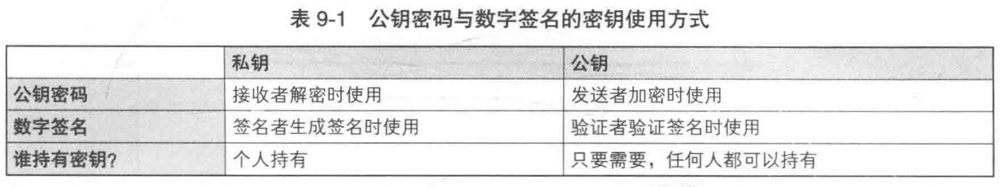
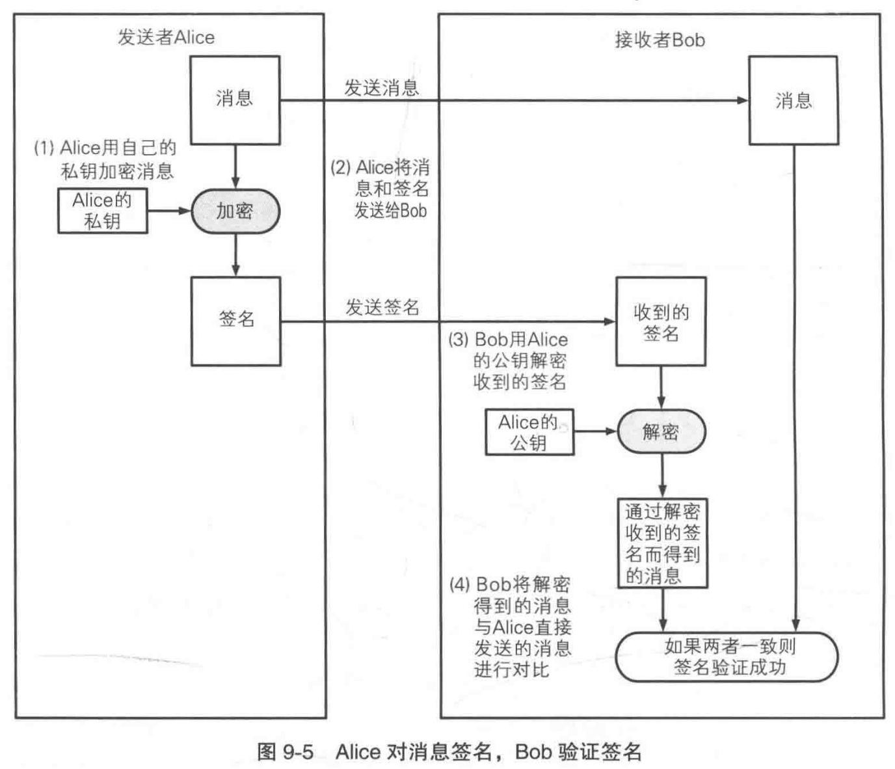
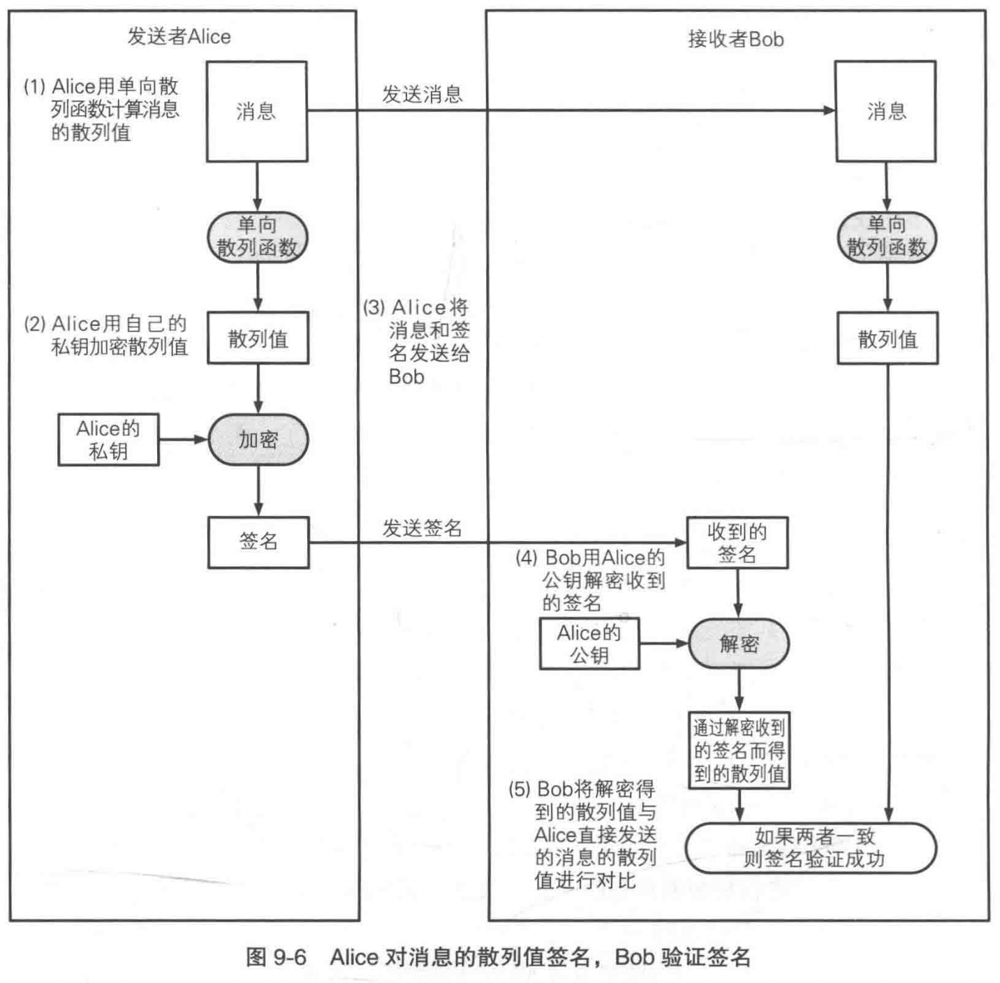
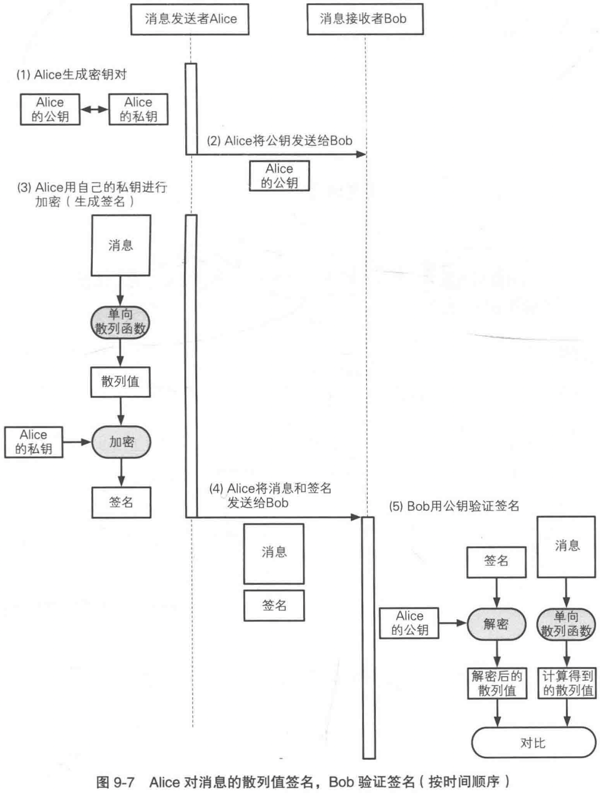
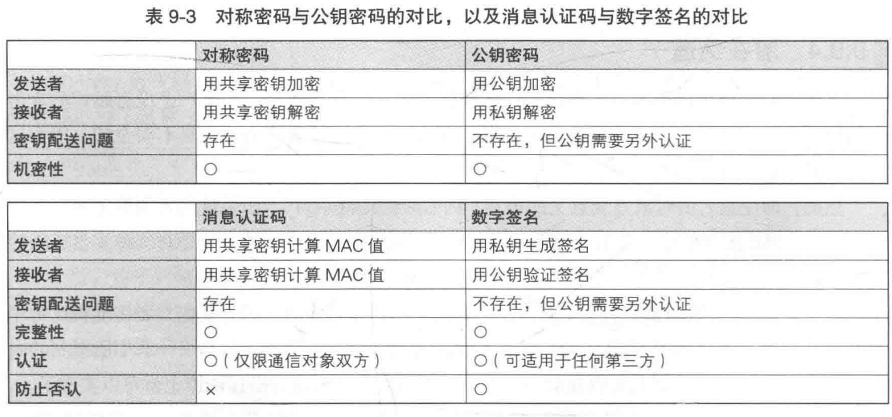
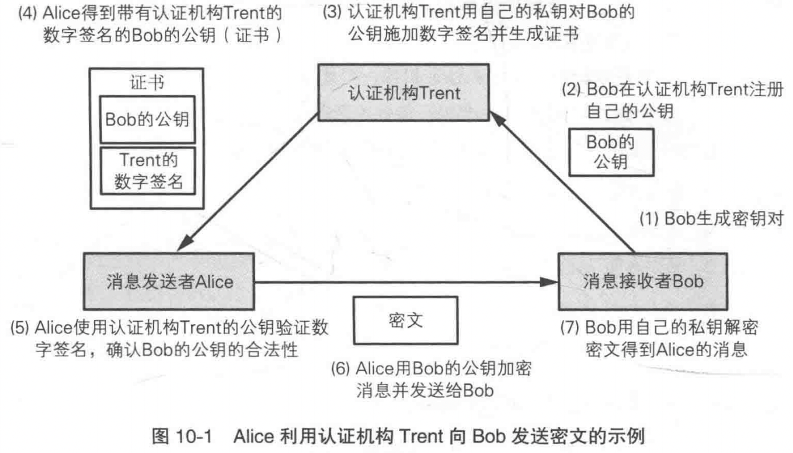
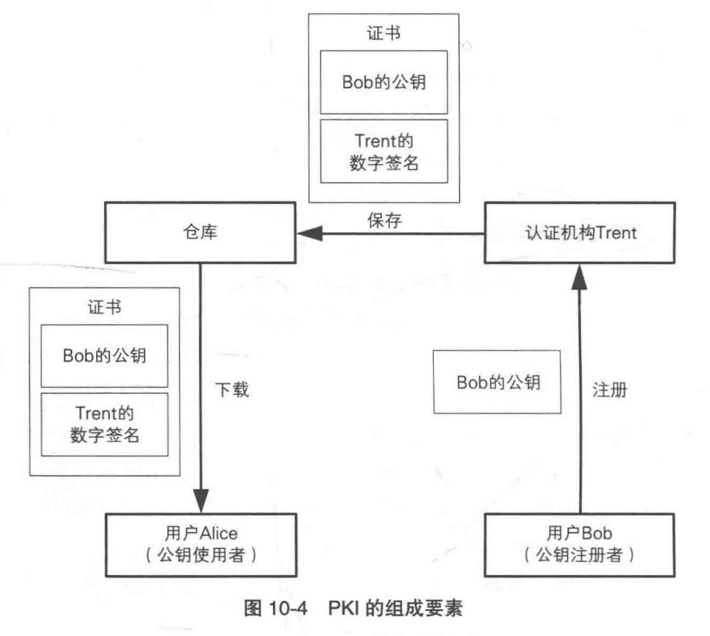
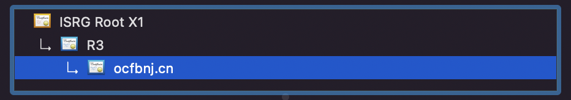

# 密码学入门（7）：数字签名和证书

## 数字签名

在上篇文章我们知道了**消息认证码无法防止否认**。因为发送者 Alice 和接收者 Bob 两者之间**共享同一个密钥**，所以 Alice 和 Bob 都可以生成 MAC 值，因此 Alice 可以否认自己发送过这条消息， Bob 也无法向第三方证明消息确实来自 Alice。假设 Alice 想向 Bob 借钱，她向 Bob 发送了一条 $100$ 万元借条的邮件，Bob 不能轻易相信这封邮件，因为 Alice 可以事后以“我不知道这张借条”为由来进行**否认**。

消息认证码无法防止否认的原因在于发送者和接收者共享一个密钥，所以我们需要发送者和接收者**各自使用不同的密钥**。Alice 使用自己的私钥通过消息生成一个“签名”，而 Bob 则使用一个公钥对签名进行验证，这样就可以确保只有 Alice 才能生成这个“签名”。我们把这种技术称为**数字签名**（digital signature）。

数字签名和公钥密码的结构非常相似，它们都有一个公钥和私钥。它们之间的区别在于，公钥密码用**公钥加密，私钥解密**；而数字签名用**私钥签名，公钥验证签名**。数字签名相当于把公钥密码反过来用。

由于公钥和私钥是配对的，用公钥加密的密文只能由配对的私钥才能解密，用私钥加密的密文只能由配对的公钥才能解密。所以如果用某个公钥成功解密了密文，就能证明这段密文是由与该公钥配对的私钥进行加密得到的。数字签名中使用私钥加密（签名，在这里加密的作用并不是为了保证机密性），因为只有持有私钥的人才能生成该签名，所以可以利用这个性质来实现签名的**不可否认**。

### 数字签名的方法

- 直接对消息签名：这种方法易于理解，但实际上不会使用这种方法，因为公钥密码对整个消息加密（签名）的速度很慢，而且主动攻击者 Mallory 可能可以利用数字签名攻击公钥密码（因为数字签名的签名过程类似于公钥密码的解密过程，所以公钥密码和数字签名最好使用不同的密钥对）。

- 对消息的散列值签名：为了解决直接对消息签名带来的问题，我们可以通过**单向散列函数**将消息变成更短的散列值，然后对散列值加密（签名）。

通过上图我们可以看到，Alice 将公钥发送给 Bob 这一过程会受到中间人攻击，因为 Bob 无法确认该公钥是否是由 Alice 发出的，貌似我们陷入了一个死循环。这个问题我们稍后讨论。

### 各种密码技术的对比

- 对称密码与公钥密码的对比，以及消息认证码与数字签名的对比：

- 对称密码的**密钥是机密性的精华**，单向散列函数的**散列值是完整性的精华**。

### 数字签名无法解决的问题

数字签名可以保证完整性、提供认证功能、还可以防止否认。但正确使用数字签名有一个大前提，就是用于验证签名的**公钥必须属于真正的发送者**。即使数字签名算法再强大，如果公钥匙伪造的，那么数字签名就会完全失效。

为了确认得到的公钥是否合法，我们需要使用**证书**。

## 证书

**公钥证书**（Public-Key Certificate，PKC），就是将公钥当作一条消息，由一个可信的**认证机构**（Certification Authority，CA）对其进行数字签名，公钥和数字签名合起来称为公钥证书。通过公钥证书，我们就可以知道认证机构认定该公钥的确属于此人。公钥证书也简称为**证书**（certificate）。

公钥证书的示例:

其中步骤(1)、(2)、(3)仅在注册新公钥时才会进行，并不是每次通信都需要。

但是这么做只是把问题转移了，我们又需要另一个公钥对 Trent 的数字签名进行验证，在获取认证机构 Trent 的公钥的过程中又会出现相同的问题。实际上，认证机构的公钥已经内置在了电脑或手机的操作系统中。

### 实际生成一张证书

如果你有一台云服务器和一个域名，则可以通过 Certbot 免费申请一张 90 天的证书，具体做法可以参考[我之前的文章](<https://blog.csdn.net/weixin_43669941/article/details/108021145>)，最后我们会得到一个证书和一个密钥。

证书标准规范：证书是由认证机构颁发的，使用者需要对证书进行验证，因此如果证书格式千奇百怪那就不方便了。人们制定了证书的保准规范，其中最广泛的是由 ITU 和 ISO 制定的 X.509 规范。我们可以通过 x509 规范查看得到的证书（太长了，用`...`省略了一些内容）：

~~~bash
$ openssl x509 -in /etc/letsencrypt/live/ocfbnj.cn/fullchain.pem -text -noout
Certificate:
    Data:
        Version: 3 (0x2)
        Serial Number:
            04:5d:fb:a0:e2:6e:9f:00:73:db:a3:57:84:78:ba:5d:6d:9b
        Signature Algorithm: sha256WithRSAEncryption
        Issuer: C = US, O = Let's Encrypt, CN = R3
        Validity
            Not Before: Jan 23 09:34:19 2022 GMT
            Not After : Apr 23 09:34:18 2022 GMT
        Subject: CN = ocfbnj.cn
        Subject Public Key Info:
            Public Key Algorithm: rsaEncryption
                RSA Public-Key: (2048 bit)
                Modulus:
                    00:96:8b:71:4c:e2:20:21:ef:18:1f:be:fc:e9:7f:
                    c9:55:7a:98:4c:ae:16:19:d0:7b:fd:da:ab:4a:cc:
                    91:ca:d3:23:53:21:45:78:1d:14:b6:bf:90:33:a7:
                    72:2f:08:e3:19:11:3c:50:d6:ac:29:e2:0e:ce:d3:
                    a1:b5:e1:4b:59:39:64:d1:31:91:8b:8e:5b:ca:05:
                    b1:82:51:15:d0:fa:bd:ee:f9:33:31:f1:a9:13:ef:
                    b1:d3:cb:8b:0f:27:3a:ba:98:1a:d7:c8:41:4f:13:
                    ea:b8:f7:2d:dd:bf:7d:8e:86:59:68:be:ad:a5:7f:
                    1b:67:0b:4d:62:2f:b4:24:7a:6b:72:7e:22:2f:b2:
                    1b:ee:d3:88:50:09:38:9d:fc:1c:99:bd:20:68:9d:
                    7d:1d:39:ba:10:27:c2:7f:54:81:e5:dd:0e:f6:1b:
                    23:a1:f9:af:18:3d:02:da:f3:55:1a:77:2f:db:ac:
                    cc:d3:01:bf:69:f2:e1:a2:50:f4:3d:31:99:ef:79:
                    cc:eb:d0:51:f3:26:5c:f6:e3:50:ee:7f:ea:b7:b6:
                    38:af:6b:9b:40:95:e4:95:ad:62:32:f3:63:75:74:
                    02:c5:ab:c8:04:40:27:94:aa:1e:fa:49:a2:a8:2e:
                    2b:86:4a:ab:2e:97:19:ac:5d:16:52:09:cb:9c:e7:
                    86:d3
                Exponent: 65537 (0x10001)
        X509v3 extensions:
            ...

            X509v3 Subject Alternative Name: 
                DNS:*.ocfbnj.cn, DNS:ocfbnj.cn
            X509v3 Certificate Policies: 
                Policy: 2.23.140.1.2.1
                Policy: 1.3.6.1.4.1.44947.1.1.1
                  CPS: http://cps.letsencrypt.org

            ...
    Signature Algorithm: sha256WithRSAEncryption
         5e:c2:f0:aa:b4:1a:68:c2:1f:eb:9a:80:d2:ce:22:85:87:22:
         49:f0:c3:a0:4f:c2:7b:ec:94:16:5f:e4:fb:09:83:a8:f7:33:
         e1:57:81:35:a1:0a:c3:f7:be:d1:85:50:3c:05:d1:18:9a:0c:
         13:f7:c4:61:0c:39:43:f2:da:e0:86:1c:61:ac:c1:61:94:e4:
         58:fc:f5:fb:b2:6d:48:ba:aa:e4:d3:6a:4c:04:55:fb:48:ae:
         22:8e:81:79:e7:5f:d9:fb:90:3e:db:20:29:e4:f0:7e:9d:34:
         ab:49:77:30:0d:73:55:99:b6:bc:d5:dd:12:4f:ef:c3:a9:9b:
         7e:ce:9a:90:db:49:c3:fe:eb:2c:90:93:01:91:03:4a:ac:f1:
         77:e1:98:10:55:7f:e8:f6:ed:d3:7f:5b:0e:f0:63:1f:10:0f:
         d3:80:9a:6b:47:8c:e5:2c:ca:0a:0c:2c:0c:84:2c:66:2f:51:
         72:96:bb:c7:0b:67:7e:a7:8d:53:e8:f2:c9:8f:44:b0:e3:0e:
         96:cd:91:36:ce:c3:fa:b7:55:ba:67:92:ca:41:20:7c:b0:d1:
         1b:1b:22:2c:b1:4a:bc:f7:26:49:6b:7a:f3:13:d1:a8:4e:83:
         76:12:cd:87:ea:fa:9c:20:66:3d:df:e3:15:ba:52:1b:29:44:
         32:78:65:5c
~~~

**公钥基础设施**（Public-Key Infrastructure，PKI）：仅制定证书的规范还不足以支持公钥的实际运用，我们还需要很多其他规范，例如证书应该由谁来颁发，如何颁发，私钥泄漏时应该如何作废证书，计算机之间的数据交换应采用什么格式等。

### 证书的层级结构

认证机构对用户的公钥进行了签名，并生成了证书。接下来用户需要使用认证机构的公钥，对证书上的数字签名进行验证。

对于认证机构的公钥，可以由其他的认证机构进行数字签名，从而对认证机构的公钥进行验证。一个认证机构来验证另一个认证机构的公钥，这样的关系可以迭代好几层。以我申请的证书为例，关系链如下：

对于 `ocfbnj.cn` 的公钥，由 `R3` 认证机构颁发证书；对于 `R3` 的公钥，由 `ISRG Root X1` 认证机构颁发证书，以此类推。但这个链条不能无限延伸，总要有一个终点。在这里这个终点就是 `ISRG Root X1` 认证机构，该认证机构一般称为**根 CA**（Root CA）。对于 `ISRG Root X1` 认证机构，则由 `ISRG Root X1` 认证机构自己来颁发证书，这种对自己的公钥进行数字签名的行为称为**自签名**（self-signature）。

假设现在要对 `ocfbnj.cn` 的数字签名进行验证：

1. 首先从根 CA 开始。如果连根 CA 的公钥都不合法的话，那么就无法验证证书了。
2. 接下来，取得 `R3` 认证机构的公钥证书，这个证书上带有 `ISRG Root X1` 认证机构的数字签名。用 `ISRG Root X1` 认证机构的公钥对数字签名进行验证。如果验证成功，则说明获得了和合法的 `R3` 认证机构的公钥。
3. 再接下来，取得 `ocfbnj.cn` 的公钥证书，这个证书上带有 `R3` 认证机构的数字签名。用合法的 `R3` 认证机构的公钥对数字签名进行验证。如果验证成功，则说明获得了合法的 `ocfbnj.cn` 的公钥。

## 参考

《图解密码技术》
