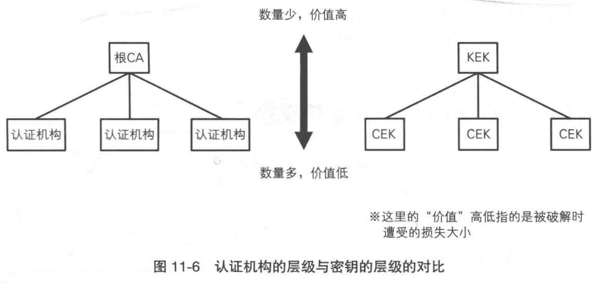
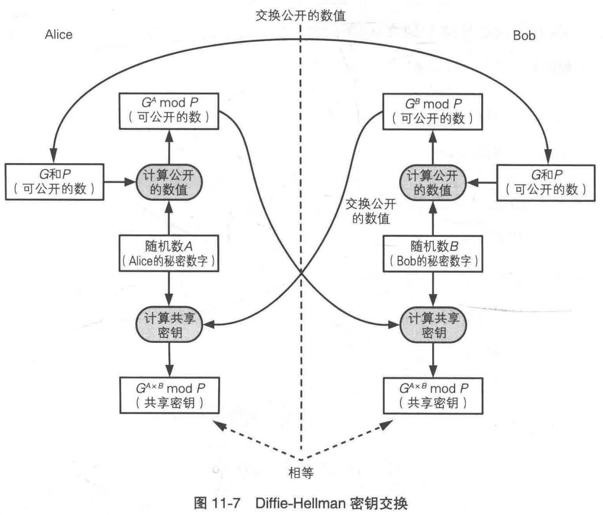
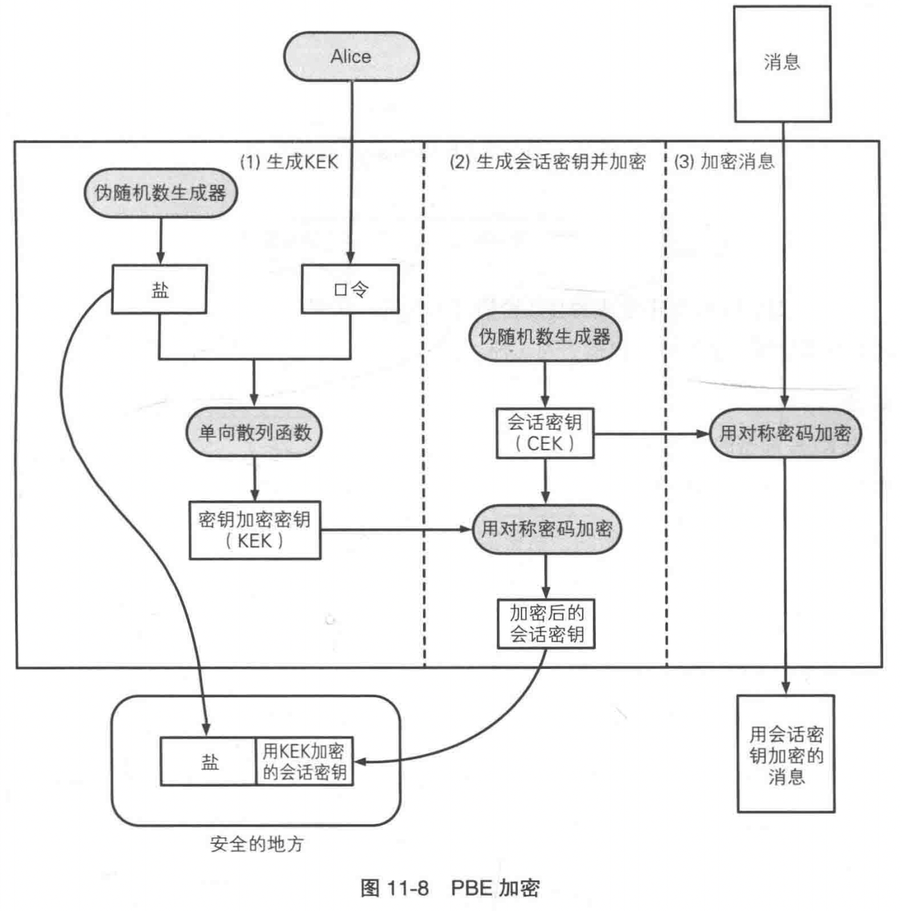
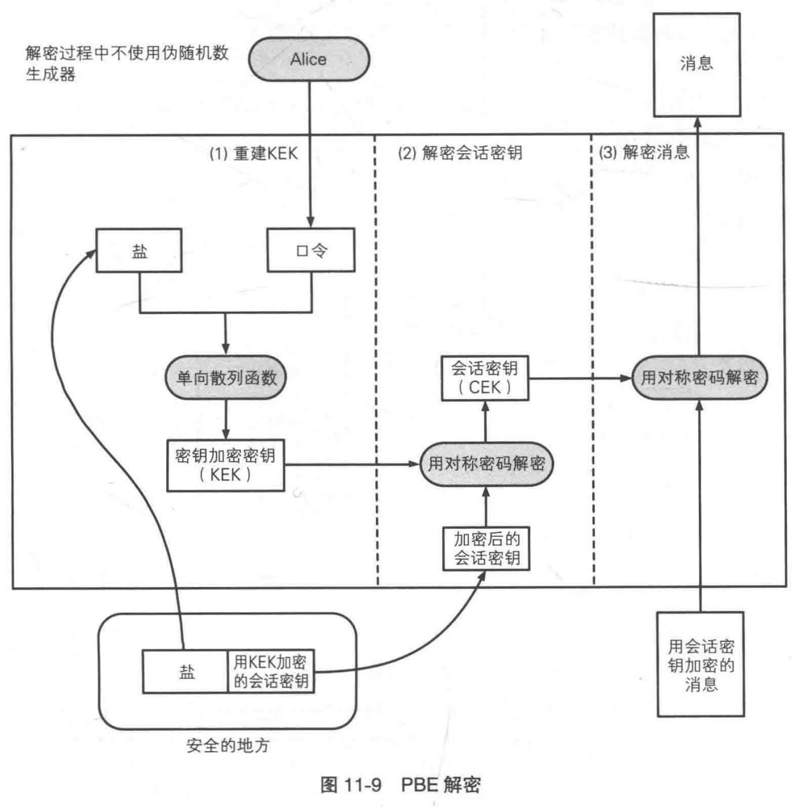
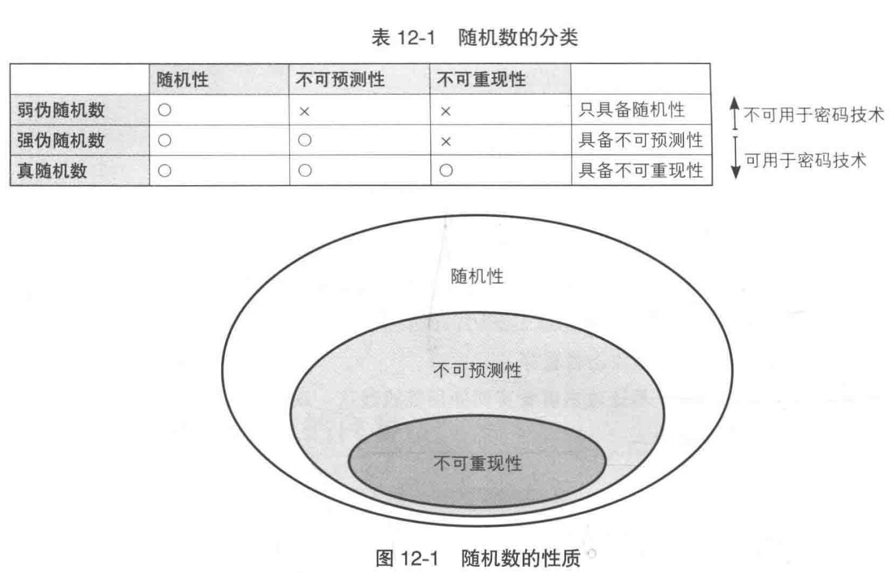
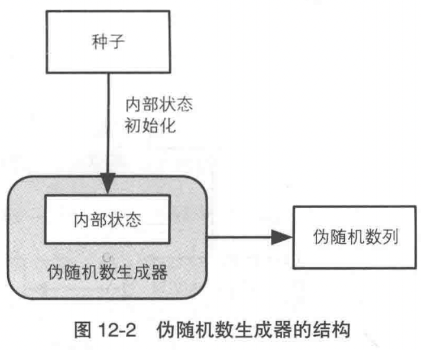
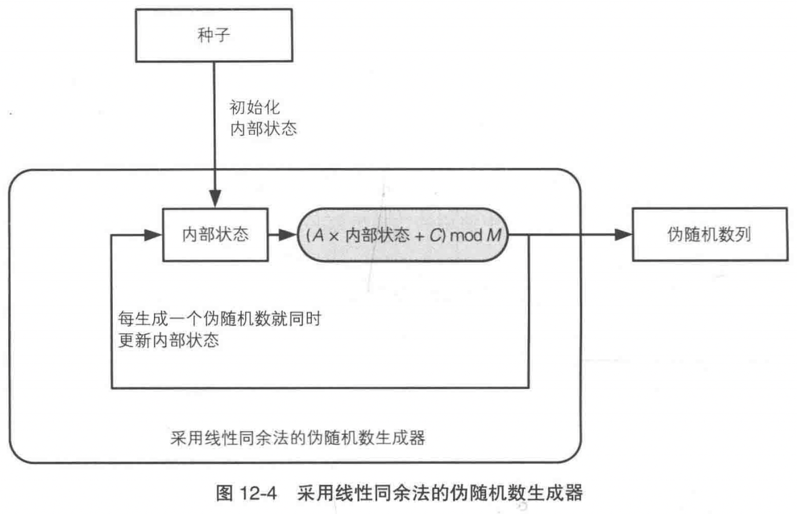
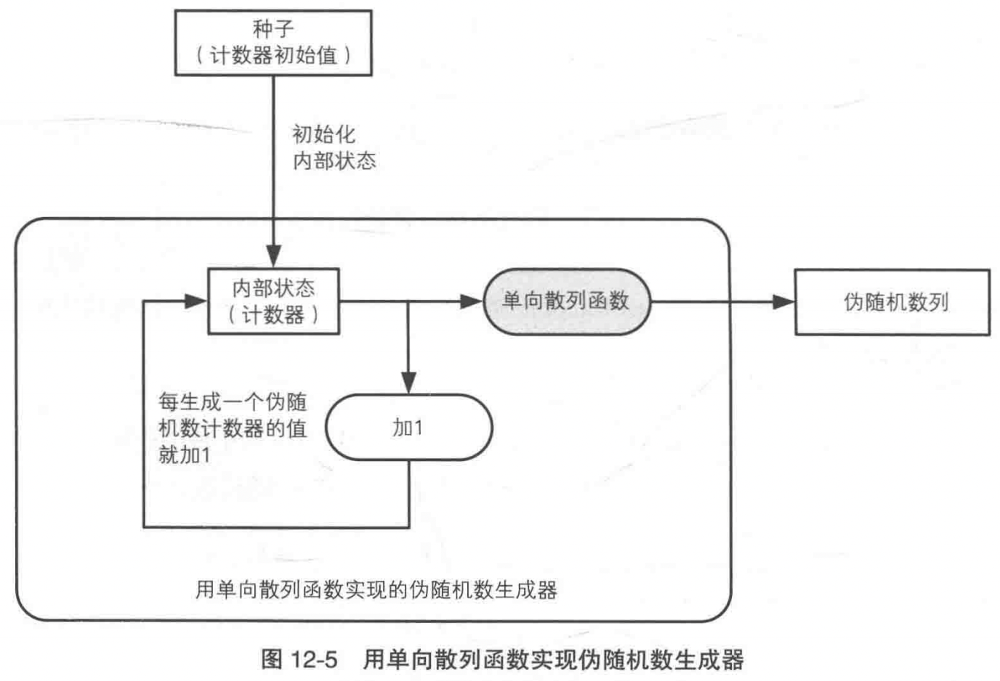
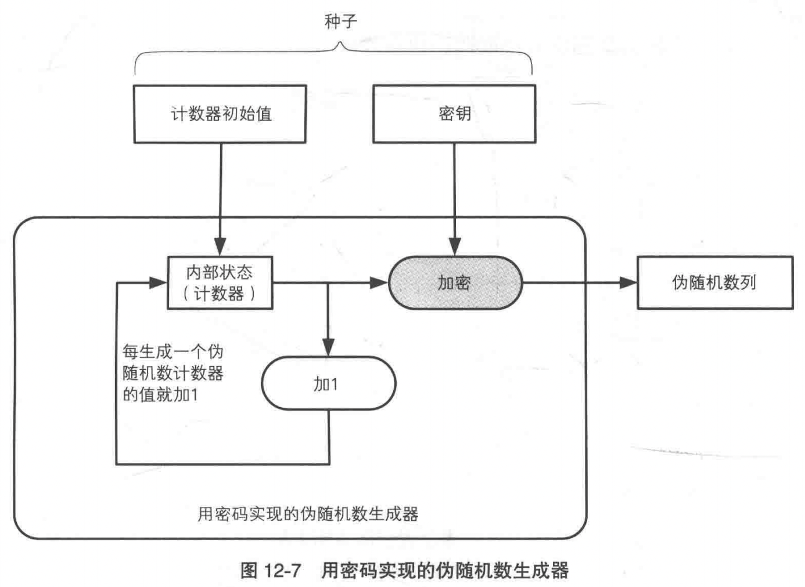

# 密码学入门（8）：密钥和随机数

## 密钥

**密钥**（key）是一个比特序列，但它所具有的价值超乎我们的想象。**密钥和明文是等价的**，如果密钥落入 Eve 手里，Eve 可以用密钥将密文转换为明文。

### 各种不同的密钥

- 在**对称密码**中，加密和解密使用同一个**共享密钥**。
- 在**公钥密码**中，**公钥**用于加密，**私钥**用于解密，它们共同称为**密钥对**。
- 在**消息认证码**中，发送者和接受者通过**共享密钥**来进行认证。
- 在**数字签名**中，**私钥**用于生成签名，**公钥**用于验证签名。

其中，对称密码和公钥密码的密钥都是**用于确保机密性的密钥**；消息认证码和数字签名所使用的密钥都是**用于认证的密钥**。

一直被重复使用的密钥称为**主密钥**（master key），每次通信都更换的密钥称为**会话密钥**（session key）。由于会话密钥只在本次通信中使用，窃听者即使获取了本次通信的会话密钥，也只能破译本次通信的内容。

### 密钥的管理

- 生成密钥
  - 用**随机数**生成密钥
  - 用**口令**（password）生成密钥
- 配送密钥
  - 事先共享密钥
  - 使用密钥分配中心
  - 使用公钥密码
  - Diffie-Hellman 密钥交换
- 更新密钥：在通信的过程中，定期改变密钥
  - 例如，**用当前密钥的散列值作为下一个密钥**，这样如果窃听者获取了当前密钥，也只能破译本次及之后的通信内容，而无法破译该密钥之前的通信内容。这种防止破译过去的通信内容的机制，称为**后向安全**（backward security）。
- 保存密钥
  - **人类无法记住具有实用长度的密钥**。
  - 但我们可以用$1$个密钥加密$100$万个密钥（这个密钥被称为**加密密钥的密钥**，Key Encrypting Key，KEK；被加密的密钥被称为**加密内容的密钥**，Contents Encrypting Key，CEK），保管$1$个密钥比保管$100$万个密钥要简单，但这$1$个密钥的价值相当于前面$100$万个密钥价值的总和，类似于 CA 机构。
  
- 作废密钥：密钥的作废和生成是同等重要的，因为密钥和明文是等价的。

### Diffie-Hellman 密钥交换

Diffie-Hellman 密钥交换（Diffie-Hellman key exchange，缩写为 D-H）是 1976 年由 Whitfield Diffie 和 Martin Hellman 共同发明的一种算法。使用这种算法，通信双方仅通过交换一些可以公开的信息就能够生成出共享的密钥。虽然这种方法的名字叫“密钥交换”，但实际上双方并没有真正交换密钥，而是通过计算生成出了一个相同的共享密钥。因此这种方法也称为 Diffie-Hellman 密钥协商（Diffie-Hellman key agreement）。

Diffie-Hellman 密钥交换的步骤：

1. Alice 向 Bob 发送两个质数 $P$ 和 $G$，$P$ 必须是一个非常大的质数，而 $G$ 是一个和 $P$ 相关的数，称为**生成元**（generator）。$P$ 和 $G$ 不需要保密。
2. Alice 选择一个 $1 \sim P - 2$ 的随机整数 $A$ 并且将 $G^{A} \bmod P$ 发送给 Bob 。
3. Bob 选择一个 $1 \sim P - 2$ 的随机整数 $B$ 并且将 $G^B \bmod P$ 发送给 Alice 。
4. Alice 计算的密钥 $= (G^B \bmod P)^A \bmod P = G^{B \times A} \bmod P$。
5. Bob 计算的密钥 $= (G^A \bmod P)^B \bmod P = G^{A \times B} \bmod P$。
6. Alice 计算的密钥 $=$ Bob 计算的密钥 $= G^{A \times B} \bmod P$。

在上述过程中，双方交换的数字一共有 $4$ 个：$P$、$G$、$G^A \bmod P$、$G^B \bmod P$。根据这 $4$ 个数字计算出 Alice 和 Bob 的共享密钥 $G^{A \times B} \bmod P$ 是非常困难的。这是因为根据 $G^A \bmod P$ 计算出 $A$ 是非常困难的（计算出 $B$ 类似），它的有效算法到现在还没有出现，这个问题称为有限域（finite field）的**离散对数问题**。

Diffie-Hellman 密钥交换是利用“离散对数问题”的复杂度来实现密钥的安全交换，如果将“离散对数问题”改为“椭圆曲线上的离散对数问题”，这样的算法就称为**椭圆曲线 Diffie-Hellman 密钥交换**（Elliptic Curve Diffie–Hellman key exchange，缩写为 ECDH）。椭圆曲线 Diffie-Hellman 密钥交换在总体流程上是不变的，但能用较短的密钥长度实现较高的安全性。

Diffie-Hellman 密钥交换的问题：会受到中间人攻击。

### 基于口令的密码（PBE）

**基于口令的密码**（Password Based Encryption，PBE）是一种根据口令生成密钥并用该密钥进行加密的方法。

我们想要保存密钥，但我们又无法记住具有实用长度的密钥。PBE 的意义：

- 用密钥（CEK）对消息进行加密，需要确保密钥（CEK）的机密性。
- 用另一个密钥（KEK）对密钥（CEK）进行加密，又需要确保（KEK）的机密性。
- 用口令来生成密钥（KEK）又容易遭到字典攻击。
- 所以我们可以用口令和盐（salt，用来防御**字典攻击**）共同生成密钥（KEK），然后把盐和加密后的密钥（CEK）保存，将密钥（KEK）丢弃，口令记在脑子中。

PBE 的加密过程：

PBE 的解密过程：

### 密钥派生函数（KDF）

**密钥派生函数**（Key Derivation Function，KDF）从诸如主密钥或口令派生出一个或多个具有密码学强度的密钥。之前我们说过，人类无法记住具有实用长度的密钥。因此我们需要将用户的口令（password）转换成一个具有密码学强度的密钥，即使口令的强度很低。

**字典攻击**（dictionary attack）：类似于单向散列函数，当主动攻击者 Mallory 获取到一个口令的散列值后，他想通过口令得到密钥，可以用大量的候选口令生成散列值，然后与目标散列值对比。由于用户的口令强度很低（例如使用`123456`），所以字典攻击成功的可能性很高。

**盐**（salt）：由于直接通过口令生成密钥容易遭到字典攻击，我们可以对口令加盐，即对口令的特定位置增加特定字符（例如将 `123456` 变为 `123456abcdefghijklmnopqrstuvwxyz`），然后用口令和盐共同生成密钥，这样可以让字典攻击变得更困难从而防御字典攻击。

例如，ss 协议在每次通讯中，使用了一个随机生成的盐，然后用 `hkdf` 通过主密钥和盐生成一个具有密码学强度的会话密钥。但 ss 协议的盐是公开的，因此只是能生成一个具有密码学强度的密钥，如果口令的强度很低，还是无法防御字典攻击。

## 随机数

虽然说生成随机数的技术不是很引人注意，但它在密码技术中扮演着十分重要的角色。例如，下面的场景中就会用到随机数：

- 生成密钥：用于对称密码和消息认证码。
- 生成密钥对：用于公钥密码和数字签名。
- 生成初始化向量（IV）：用于分组密码的 CBC、CFB 和 OFB 模式。
- 生成盐。

如果攻击者知道了密钥，即使密码算法的强度再高，也会立刻变得形同虚设。

### 随机数的性质

随机数的性质可以简单分为以下三类：

- 随机性：不存在统计学偏差，是完全杂乱的数列。具备随机性的伪随机数称为**弱伪随机数**。
- 不可预测性：不能从过去的数列推测出下一个出现的数。具备不可预测性的伪随机数称为**强伪随机数**。
- 不可重现性：除非将数列本身保存下来，否则不能重现相同的数列。具备不可重现性的随机数称为**真随机数**。
  - 仅靠软件是无法生成出具备不可重现性的随机数列的，这是因为运行软件的计算机本身仅具备有限的内部状态，而在内部状态相同的条件下，软件必然只能生成相同的数，因此软件所生成的数列在某个时刻一定会出现重复。
  - 要生成具备不可重现性的随机数列，需要从不可重现的物理现象中获取信息，比如周围的温度和声音的变化、用户移动的鼠标的位置信息。

### 伪随机数生成器

生成随机数的硬件设备称为**随机数生成器**（Random Number Generator，RNG）。生成随机数的软件称为**伪随机数生成器**（Pseudo Random Number Generator，PRNG），因为仅靠软件无法生成真随机数。具备不可预测性的伪随机数生成器才能用于密码技术。

伪随机数生成器的结构：

- 伪随机数生成器的**内部状态**是指伪随机数生成器所管理的内存中的数值。
- 伪随机数生成器的**种子**（seed）用来对伪随机数的内部状态进行初始化。

下面我们来看一些具体的伪随机数生成器。

#### 线性同余法

**线性同余法**（linear congruential method）是一种使用很广泛的伪随机数生成算法，例如 C 语言的 `rand()` 以及 C++ 中的 `std::linear_congruential_engine`。但它不能用于密码技术，因为它不具备不可预测性。

假设我们要生成的伪随机数列为 $R_0, R_1, R_2, ...$，$A, C, M$ 都是常量，且 $A$ 和 $C$ 都小于 $M$，那么：

- 第一个伪随机数 $R_0 = (A \times 种子 + C) \bmod M$
- $R_1 = (A \times R_0 + C) \bmod M$
- $R_{n + 1} = (A \times R_n + C) \bmod M$

假设攻击者已知 $A, C, M$，攻击者只需要得到所生成的伪随机数中的任意一个（$R$），就可以预测下一个伪随机数。

#### 单向散列函数法

使用单向散列函数可以编写出能够生成具备不可预测性的伪随机数列（即强伪随机数）的伪随机数生成器。

假设攻击者要预测下一个伪随机数，就需要知道计数器的值，想要知道计数器的值，就需要破解单向散列函数的单向性，这是非常困难的。在这里，**单向散列函数的单向性是支持伪随机数生成器不可预测性的基础**。

#### 密码法

我们可以使用密码来编写能够生成强伪随机数的伪随机数生成器，既可以使用 AES 等对称密码，也可以使用 RSA 等公钥密码。

和单向散列函数法类似，假设攻击者要预测下一个伪随机数，就需要知道计数器的值，想要知道计数器的值，就需要破解密码的机密性，这是非常困难的。在这里，**密码的机密性是支持伪随机数生成器不可预测的基础**。

## 参考

《图解密码技术》
