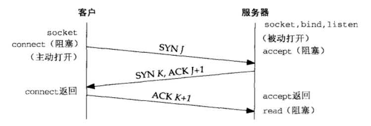
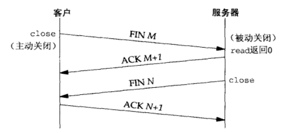
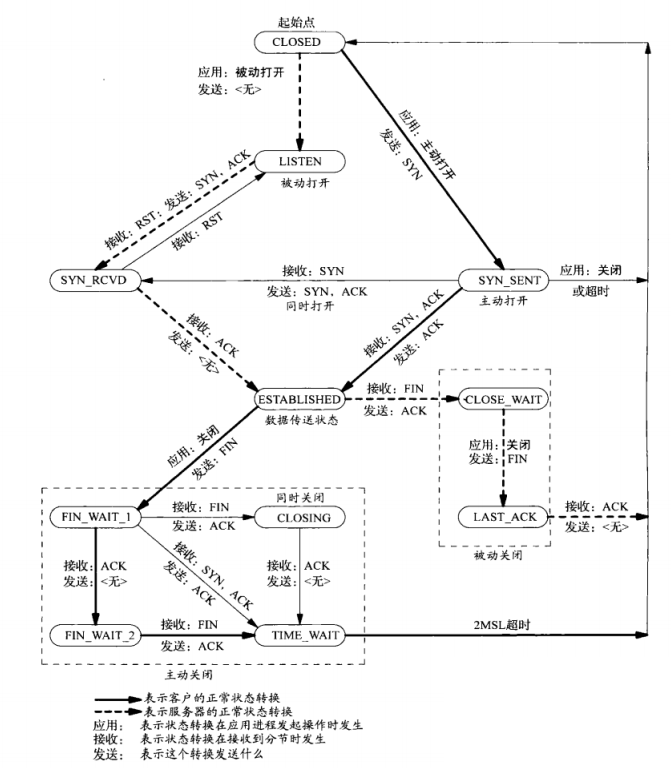
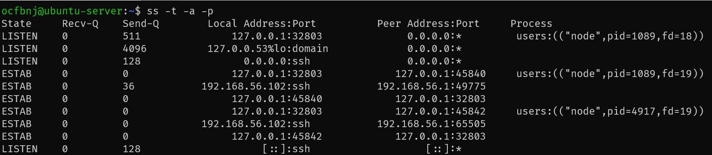
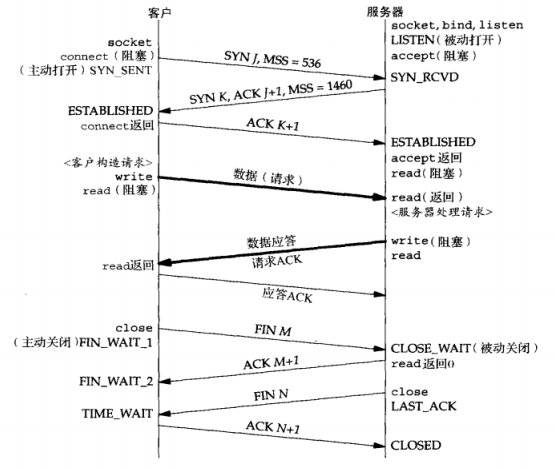

# TCP 连接的建立和中止

理解TCP连接的建立和中止，有助于我们理解`connect`、`accept`和`close`这3个函数。

## TCP连接的建立

1. 服务器准备好接受外来的连接。这通常通过调用`socket`、`bind`和`listen`这3个函数来完成，我们称之为**被动打开（passive open）**。
2. 客户通过`connect`发起**主动打开（active open）**。这导致TCP客户发送一个**SYN**分节，它告诉服务器客户将在（待建立）的连接中发送的数据的初始序列号。通常SYN不携带数据，其所在IP数据包只有一个IP首部、一个TCP首部及可能有的TCP选项。
3. 服务器必须确认（ACK）客户的SYN，同时自己也得发送一个SYN分节，它含有服务器将在同一连接中发送的数据的初始序列号。服务器在单个分节中发送**SYN**和对客户SYN的**ACK（确认）**。
4. 客服必须确认服务器的**SYN**。

这种交换至少需要3个分组，因此成为TCP的**三路握手（three-way handshake）**。

## TCP连接的中止

1. 某个应用进程首先调用`close`，我们称该端执行**主动关闭（active close）**。该段的TCP于是发送一个**FIN**分节，表示数据发送完毕。
2. 接收到这个FIN的对端执行**被动关闭（passive close）**。这个FIN由TCP确认。他的接收作为一个文件结束符（end-of-file）传递给接收端应用进程（放在已排队等候该应用进程接受的任何其他数据之后），因为FIN的接收意味着接收端应用进程在相应连接上再无额外数据可接收。
3. 一段时间后，接收到这个文件结束符的应用进程调用`close`关闭他的套接字。这导致TCP也发送一个**FIN**。
4. 接收这个最终FIN的原发送端（即执行主动关闭的那一段）TCP**确认（ACK）**这个FIN。

因为每个方向都需要**一个FIN**和**一个ACK**，因此通常需要4个分节。**但某些情况下步骤1的FIN可能随数据一起发送，步骤2和步骤3发送的分节有可能被合并成一个分节。**

## TCP状态转换图

TCP涉及连接建立和连接中止的操作可以用**状态转换图（state transition diagram）**来说明。

TCP为一个连接定义了11种状态。我们用粗实线表示通常的客户状态转换，用粗虚线表示通常的服务器状态转换。

这些状态可以使用*netstat*查看（现已过时，使用*ss*代替），它是一个很有用的调试工具。

## 观察分组

该图展示了一个完整的TCP连接所发生的实际分组交换情况，包括连接建立、数据传送和连接中止3个阶段。图中还展示了每个端点经历的TCP状态。

需要注意的是如果该连接的整个目的仅仅是发送一个单分节的请求和接收一个单分节的应答，那么使用TCP有8个分节的开销。如果改用UDP，那么只需交换两个分组：一个承载请求，一个承载应答。

## TIME_WAIT状态

MSL是任何IP数据报能够在因特网中存活的最长时间。这个状态的持续时间是*MSL（maximum segment lifetime）*的两倍，有时候称为**2MSL**。

任何TCP的实现都必须为MSL选择一个值。RFC 1122的建议值是2分钟，但源自Berkeley的实现传统上改用为30秒。

TIME_WAIT状态有两个存在的理由：

1. 可靠地实现TCP全双工连接的终止。
2. 允许老的重复分节在网络中消逝。

第一个理由可以通过查看上图并**假设最终的ACK丢失了**来解释。服务器将重新发送它的最终的那个FIN，因此客户必须维护状态信息，以允许它重新发送最终那个ACK。

为理解存在TIME_WAIT状态的第二个理由，我们假设在12.106.32.254的1500端口和206.168.112.219的21端口之间有一个TCP连接。我们关闭这个连接，**过一段时间后在相同的IP地址和端口之间建立另一个连接**。后一个连接称为前一个连接的化身(incarnation)，因为它们的IP地址和端口号都相同。**TCP必须防止来自某个连接的老的重复分组在该连接已终止后再现**，从而被误解成属于同一连接的某个新的化身。为做到这一点，**TCP将不给处于TIME_WAIT状态的连接发起新的化身**。**既然TIME_WAIT状态的持续时间是MSL的2倍，这就足以让某个方向上的分组最多存活MSL秒即被丢弃，另一个方向上的应答最多存活MSL秒也被丢弃**。通过实施这个规则，我们就能保证每成功建立一个TCP连接时，来自该连接先前化身的老的重复分组都已在网络中消逝了。

## 参考

- 《UNIX网络编程》
