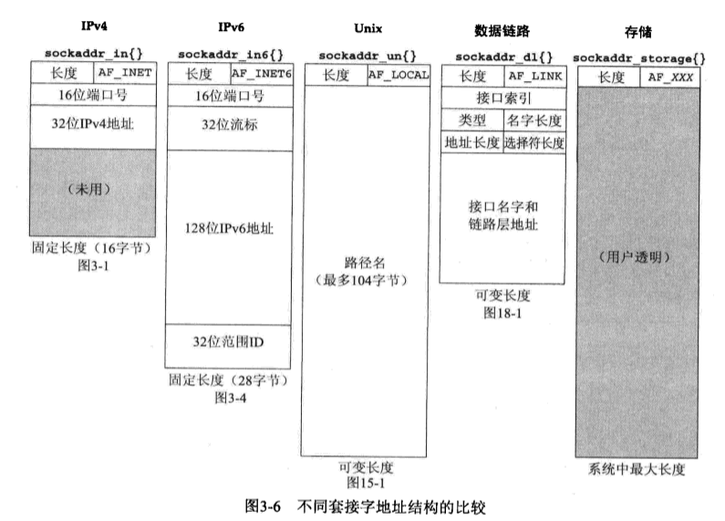

# 套接字地址结构

大多数套接字函数都需要一个指向套接字地址结构的指针作为参数。每个协议族都定义了它自己的套接字地址结构。**这些结构的名字均以sockaddr_开头，并以对应于每个协议族的唯一后缀结尾。**

## IPv4套接字地址结构

IPv4套接字地址结构以sockaddr_in命名，定义在头文件\<netinet/in.h\>中。下面是Linux下的定义（已简化）：

~~~c
struct in_addr {
    in_addr_t s_addr;        // 32位的IPv4地址（网络字节序）
};

struct sockaddr_in {
    sa_family_t sin_family;  // AF_INET
    in_port_t sin_port;      // 16位的TCP或UDP端口号（网络字节序）
    struct in_addr sin_addr; // 32位的IPv4地址（网络字节序）

    /* Pad to size of `struct sockaddr'.  */
    unsigned char sin_zero[8];
};
~~~

我们只需要关注sockaddr_in的3个字段。

- `sin_family`：它是一个16位的数据，`typedef unsigned short int sa_family_t;`。因为是IPv4套接字，使用IPv4协议，因此填AF_INET即可。

- `sin_port`：它是一个16位的数据，`typedef uint16_t in_port_t;`。填写16位的端口号即可（网络字节序）。

- `sin_addr`：它是另一个结构体`struct in_addr`，`struct in_addr`中有一个整数类型的成员`s_addr`（`typedef uint32_t in_addr_t;`）。它有两种不同的访问方法，一种是直接访问结构体`sin_addr`，一种是访问结构体中的整数类型的成员`s_addr`。由于历史原因，早期版本的`in_addr`结构体定义为多种结构体的联合，允许访问一个32位IPv4地址中的所有4个字节，或者访问它的2个16位的值，例如Winsocket2中的定义：

  ~~~c
  typedef struct in_addr {
    union {
      struct { u_char  s_b1, s_b2, s_b3, s_b4; } S_un_b;
      struct { u_short s_w1, s_w2; } S_un_w;
      u_long S_addr;
    } S_un;
  } IN_ADDR, *PIN_ADDR, *LPIN_ADDR;
  ~~~

## 通用套接字地址结构

当作为一个参数传递给任何套接字函数时，套接字地址结构总是以指针形式传递。然而以这样的指针作为参数之一的任何套接字函数必须处理来自所支持的任何协议族的套接字地址结构。

在如何声明所传递指针的数据类型上存在一个问题。有了ANSIC后解决办法很简单: `void*`是通用的指针类型。然而套接字函数是在ANSI C之前定义的，在Linux中的<sys/socket.h>头文件中定义了一个通用的套接字地址结构（已简化）：

~~~c
struct sockaddr {
    sa_family_t sa_family; /* Common data: address family and length.  */
    char sa_data[14];      /* Address data.  */
};
~~~

于是套接字函数被定义为以指向某个通用套接字地址结构的一个指针作为其参数之一，这正如bind函数的ANSI C函数原型所示：

~~~c
int bind(int sockfd, const struct sockaddr *addr, socklen_t addrlen);
~~~

其实我们只需要将`struct sockaddr *`看成`void*`即可，无论是传递给套接字函数，还是从套接字函数得到。

## IPv6套接字地址结构

IPv6套接字地址结构在`<netinet/in.h>`头文件中定义（已简化）：

~~~c
struct in6_addr {
    union {
        uint8_t __u6_addr8[16]; // 128位的IPv6地址（网络字节序）
        uint16_t __u6_addr16[8];
        uint32_t __u6_addr32[4];
    } __in6_u;
#define s6_addr __in6_u.__u6_addr8
#ifdef __USE_MISC
#define s6_addr16 __in6_u.__u6_addr16
#define s6_addr32 __in6_u.__u6_addr32
#endif
};

struct sockaddr_in6 {
    sa_family_t sin6_family;   // AF_INET6
    in_port_t sin6_port;       /* Transport layer port # */
    uint32_t sin6_flowinfo;    /* IPv6 flow information */
    struct in6_addr sin6_addr; /* IPv6 address */
    uint32_t sin6_scope_id;    /* IPv6 scope-id */
};
~~~

我们需要注意的是：

- IPv6的地址族是AF_INET6，而IPv4的地址族是AF_INET。

## 新的通用套接字地址结构

作为IPv6套接字API的一部分而定义的新的通用套接字地址结构克服了现有`struct sockaddr`的一些缺点。不像`struct sockaddr`，新的`struct sockaddr_storage`**足以容纳系统所支持的任何套接字地址结构**（是的，`struct sockaddr`确实太小了）。`sockaddr_storage`结构在<netinet/in.h>头文件中定义（已简化）：

~~~c
struct sockaddr_storage {
    sa_family_t ss_family;     // 地址族：AF_xxx等
    char __ss_padding[_SS_PADSIZE];
    __ss_aligntype __ss_align; /* Force desired alignment.  */
};
~~~

s`ockaddr_storage`类型提供的通用套接字地址结构相比`sockaddr`存在以下两点差别：

- 如果系统支持的任何套接字地址结构有对齐需要，那么`sockaddr_storage`能够满足最苛刻的对齐要求。
- `sockaddr_storage`足够大，能够容纳系统支持的任何套接字地址结构。

## 套接字地址结构的比较

该图来自《UNIX网络编程》，与Linux不完全相同：

在Linux下：

~~~c
printf("%ld %ld %ld %ld %ld\n",
       sizeof(struct sockaddr),
       sizeof(struct sockaddr_storage),
       sizeof(struct sockaddr_in),
       sizeof(struct sockaddr_in6),
       sizeof(struct sockaddr_un));
~~~

输出：

~~~text
16 128 16 28 110
~~~

## 参考

- 《UNIX网络编程》
