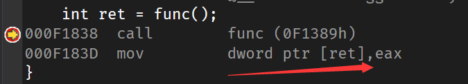
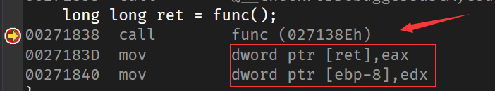
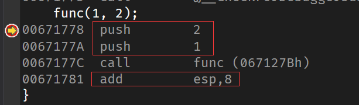
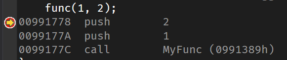
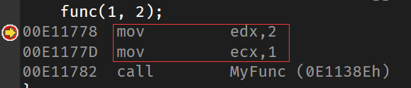
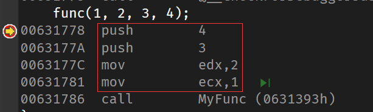

# C++ 函数的调用约定

## 引入

调用约定允许你指定被调函数和调用者之间传递参数和返回值的方式。不同的调用约定区别主要在于：

- 参数和返回值放置的位置。
- 参数传递的顺序。
- 调用前设置和调用后清理的工作，在调用者和被调用者之间如何分配。

并非所有约定都在所有支持的平台上可用，某些约定使用平台特定的实现。**这篇文章描述的是Windows x86平台。**

在 x86 平台上，所有参数在传递时都将加宽到 32 位。 返回值也将加宽到 32 位，并通过 EAX 寄存器返回。8字节的结构是一个例外，它通过EDX:EAX寄存器对返回。更大的结构将在 EAX 寄存器中作为指向被隐藏的返回结构的指针返回。

如图所示（使用VS 2019的调试功能，并非实际的汇编代码）：

## 常见的调用约定

| 关键字                                                       | 堆栈清理 | 参数传递                               |
| :----------------------------------------------------------- | :------- | :------------------------------------- |
| [__cdecl](https://docs.microsoft.com/zh-cn/cpp/cpp/cdecl?view=vs-2019) | 调用方   | 在堆栈上按相反顺序推送参数（从右到左） |
| [__stdcall](https://docs.microsoft.com/zh-cn/cpp/cpp/stdcall?view=vs-2019) | 被调用方 | 在堆栈上按相反顺序推送参数（从右到左） |
| [__fastcall](https://docs.microsoft.com/zh-cn/cpp/cpp/fastcall?view=vs-2019) | 被调用方 | 存储在寄存器中，然后在堆栈上推送       |

## __cdecl

**__cdecl**是C和C++程序的默认调用约定。由调用方负责清理堆栈。**__cdecl**调用约定创建的可执行文件比[__stdcall](https://docs.microsoft.com/zh-cn/cpp/cpp/stdcall?view=vs-2019)更大，因为它要求每个函数调用包含堆栈清理代码。

~~~cpp
void __cdecl func(int a, int b) {
    return;
}

int main() {
    func(1, 2);
}
~~~

## __stdcall

**__stdcall**调用约定用于调用 Win32 API 函数。 被调用方清理堆栈。

~~~cpp
void __stdcall func(int a, int b) {
    return;
}

int main() {
    func(1, 2);
}
~~~

## __fastcall

**__fastcall**调用约定指定函数的参数在寄存器中传递（如果可能）。在参数列表中前两个被找到的DWORD或更小的参数将从左到右传递给ECX和EDX寄存器；所有其他的参数在栈上从右到左传递。

~~~cpp
void __fastcall func(int a, int b) {
    return;
}

int main() {
    func(1, 2);
}
~~~

~~~cpp
void __fastcall func(int a, int b, int c, int d) {
    return;
}

int main() {
    func(1, 2, 3, 4);
}
~~~

## 参考

- <https://docs.microsoft.com/zh-cn/cpp/cpp/calling-conventions?view=vs-2019>
